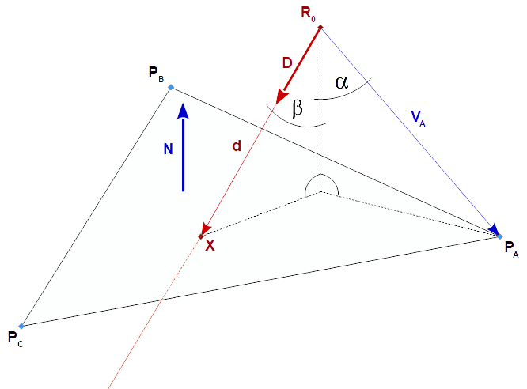

# Intersection

 

## Intersection of 2 lines (2 dimensional)

    P     ... point on the 1. line
    R     ... normalized direction of the 1. line

    Q     ... point on the 2. line
    S     ... normalized direction of the 2. line

    alpha ... angle between Q-P and R
    beta  ... angle between R and S
    
    gamma  =  180° - alpha - beta

    h  =  | Q - P | * sin(alpha)
    u  =  h / sin(beta)

    t  = | Q - P | * sin(gamma) / sin(beta)
    
    t  =  dot(Q-P, (S.y, -S.x)) / dot(R, (S.y, -S.x))  =  determinant(mat2(Q-P, S)) / determinant(mat2(R, S))
    u  =  dot(Q-P, (R.y, -R.x)) / dot(R, (S.y, -S.x))  =  determinant(mat2(Q-P, R)) / determinant(mat2(R, S))

    X  =  P + R * t  =  Q + S * u

 

## Intersection of a line and a plane

The ray is defined by a point `R0` and a direction `D`. 
The plane is defined by a triangle with the three points `PA`, `PB`, and `PC`.

The normal vector of the plane can be calculated by the cross product of 2 legs of the triangle:

    N  =  normalize( cross(PC-PA, PB-PA)

The normal distance `n` of the point `R0` to the plane is:

    n  =  | R0 - PA | * cos(alpha)  =  dot(PA - R0, N)

It follows that the distance `d` of the intersection point `X` to the origin of the ray R0 is:

    d  =  n / cos(beta)  =  n / dot(D, N)

The intersection point `X` is:

    X  =  R0 + D * d  =  R0 + D * dot(PA - R0, N) / dot(D, N)

### Intersection of the Line of Sight and the Viewport

    P0  ... any known point on the viewport
    Z   ... Z-axis of the viewport 
    C   ... camera position
    LOS ... line of sight

    X  =  C + LOS * dot(P0 - C, Z) / dot(LOS, Z)

 

