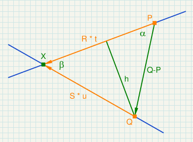

# Intersection

 

## Intersection of 2 lines (2 dimensional)

    P     ... point on the 1. line
    R     ... normalized direction of the 1. line

    Q     ... point on the 2. line
    S     ... normalized direction of the 2. line

    alpha ... angle between Q-P and R
    beta  ... angle between R and S
    
    gamma  =  180° - alpha - beta

    h  =  | Q - P | * sin(alpha)
    u  =  h / sin( beta )

    t  = | Q - P | * sin(gamma) / sin(beta)
    
    t  =  dot(Q-P, (S.y, -S.x)) / dot(R, (S.y, -S.x))  =  determinant(mat2(Q-P, S)) / determinant(mat2(R, S))
    u  =  dot(Q-P, (R.y, -R.x)) / dot(R, (S.y, -S.x))  =  determinant(mat2(Q-P, R)) / determinant(mat2(R, S))

    X  =  P + R * t  =  Q + S * u