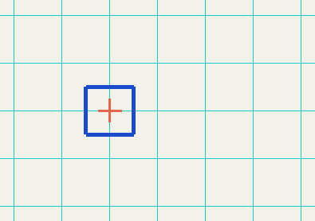
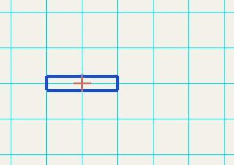
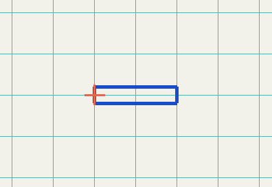
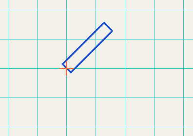
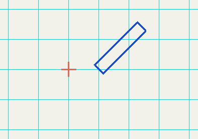
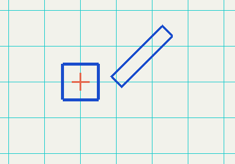
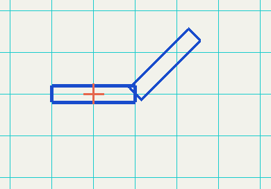
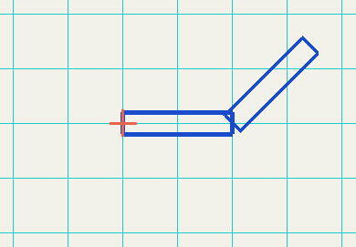
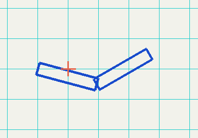
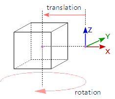

<!-- TOC -->

- [Matrix definitions and operations](#matrix-definitions-and-operations)
  - [Matrix definitions](#matrix-definitions)
    - [3*3 matrix](#33-matrix)
    - [4*4 matrix](#44-matrix)
    - [Column-major order](#column-major-order)
  - [Fixed Function pipeline matrix stack](#fixed-function-pipeline-matrix-stack)
    - [Matrix stack](#matrix-stack)
    - [Matrix stack and Shader](#matrix-stack-and-shader)
  - [Matrix operations](#matrix-operations)
    - [Matrix translation](#matrix-translation)
    - [Matrix rotation](#matrix-rotation)
    - [Matrix scaling](#matrix-scaling)
    - [Matrix multiplication (concatenation)](#matrix-multiplication-concatenation)
  - [Transposed matrix](#transposed-matrix)
    - [Transpose? It's just a matter of definition](#transpose-its-just-a-matter-of-definition)
  - [Inverse matrix](#inverse-matrix)
    - [Inverse 4*4 matrix](#inverse-44-matrix)
  - [Inverse matrix and transposed matrix](#inverse-matrix-and-transposed-matrix)
  - [Normal vector transformation](#normal-vector-transformation)

<!-- /TOC -->

# Matrix definitions and operations

## Matrix definitions

### 3*3 matrix

A 3*3 matrix looks like this:

```txt
  c0  c1  c2             x   y   z
[ Xx  Yx  Zx ]        [  0   4   8 ]
[ Xy  Yy  Zy ]        [  1   5   9 ]
[ Xz  Yz  Zz ]        [  2   6  10 ]
```

And the memory image of a 3*3 matrix like this:

```txt
[ Xx, Xy, Xz, Yx, Yy, Yz, Zx, Zy, Zz, Tx, Ty, Tz ]
```

Initializing a `mat3 m33` in GLSL:

```glsl
mat3 m33 = mat3(
    vec3( Xx, Xy, Xz ),
    vec3( Yx, Xy, Yz ),
    vec3( Zx  Zy  Zz ),
    vec3( Tx, Ty, Tz ) );
```

Addressing the columns of a `mat3 m33;` in GLSL:

```glsl
vec3 x = m33[0].xyz;
vec3 y = m33[1].xyz;
vec3 z = m33[2].xyz;
```

### 4*4 matrix

A "mathematical" 4*4 matrix looks like this:

```txt
  c0  c1  c2  c3            c0  c1  c2  c3
[ Xx  Yx  Zx  Tx ]        [  0   4   8  12 ]
[ Xy  Yy  Zy  Ty ]        [  1   5   9  13 ]
[ Xz  Yz  Zz  Tz ]        [  2   6  10  14 ]
[  0   0   0   1 ]        [  3   7  11  15 ]
```

But the memory image of a 4*4 OpenGL matrix looks like this:

```txt
[ Xx, Xy, Xz, 0, Yx, Yy, Yz, 0, Zx, Zy, Zz, 0, Tx, Ty, Tz, 1 ]
```

Initializing a `mat4 m44` in GLSL:

```glsl
mat4 m44 = mat4(
    vec4( Xx, Xy, Xz, 0.0),
    vec4( Yx, Xy, Yz, 0.0),
    vec4( Zx  Zy  Zz, 0.0),
    vec4( Tx, Ty, Tz, 1.0) );
```

Addressing the columns of a `mat4 m44;` in GLSL:

```glsl
vec4 c0 = m44[0].xyzw;
vec4 c1 = m44[1].xyzw;
vec4 c2 = m44[2].xyzw;
vec4 c3 = m44[3].xyzw;
```

### Column-major order

See [The OpenGL Shading Language 4.6, 5.4.2 Vector and Matrix Constructors](https://www.khronos.org/registry/OpenGL/specs/gl/GLSLangSpec.4.60.pdf#page=112&zoom=100,0,918), page 108  
and [OpenGL ES Shading Language 3.20 Specification, 5.4.2 Vector and Matrix Constructors, page 110](https://www.khronos.org/registry/OpenGL/specs/gl/GLSLangSpec.4.60.pdf#page=111&zoom=100,0,280):

> To initialize a matrix by specifying vectors or scalars, the components are assigned to the matrix elements in column-major order
.
>
> ```glsl
> mat4(float, float, float, float,  // first column
>      float, float, float, float,  // second column
>      float, float, float, float,  // third column
>      float, float, float, float); // fourth column
> ```

Note, in compare to a mathematical matrix where the columns are written from top to bottom, which feels natural, at the initialization of an OpenGL matrix, the columns are written from the left to the right. This leads to the benefit, that the x, y, z components of an axis or of the translation are in direct succession in the memory. This is a big advantage when accessing the axis vectors or the translation vector of the matrix.<br/>
See also [Data Type (GLSL) - Matrix constructors](https://www.khronos.org/opengl/wiki/Data_Type_(GLSL)#Matrix_constructors).

<br/>

See further:  

- [GLSL Programming/Vector and Matrix Operations][1]
- [Data Type (GLSL)][2]
- [GLSL 4x4 Matrix Fields][3]
- [Matrix Translation in GLSL is infinitely stretched](https://stackoverflow.com/questions/46763234/matrix-translation-in-glsl-is-infinitely-stretched/46763693#46763693)
- [Does WebGL matrix (mat4) notation corresponds to mathematical matrix notation](https://stackoverflow.com/questions/48367593/does-webgl-matrix-mat4-notation-correspondes-to-mathematical-matrix-notation/48367941#48367941)
- [Custom matrices & OpenGL shaders.](https://stackoverflow.com/questions/48375568/custom-matrices-opengl-shaders/48375786#48375786)
- [glm returning nan on simple translate](https://stackoverflow.com/questions/49058381/glm-returning-nan-on-simple-translate/49058953#49058953)

<br/><hr/>

## Fixed Function pipeline matrix stack

<br/>

Noice, that the [Fixed Function Pipeline](https://www.khronos.org/opengl/wiki/Fixed_Function_Pipeline) is deprecated. See also [Khronos wiki - Legacy OpenGL](https://www.khronos.org/opengl/wiki/Legacy_OpenGL).

<br/>

In OpenGL there is one matrix stack for each matrix mode (See [`glMatrixMode`][4]). The matrix modes are `GL_MODELVIEW`, `GL_PROJECTION`, and `GL_TEXTURE`.

Multiplication: See the documentation of [`glMultMatrix`][5]:

> `glMultMatrix` multiplies the current matrix with the one specified using `m`, and replaces the current matrix with the product.

Translation: See the documentation of [`glTranslate`][6]:

> `glTranslate` produces a translation by `x y z` . The current matrix (see `glMatrixMode`) is multiplied by this translation matrix, with the product replacing the current matrix.

Rotation: See the documentation of [`glRotate`][7]:

> `glRotate` produces a rotation of angle degrees around the vector `x y z` . The current matrix (see `glMatrixMode`) is multiplied by a rotation matrix with the product replacing the current matrix.

Scaling: See the documentation of [`glScale`][8]:

> `glScale`produces a nonuniform scaling along the `x`, `y`, and `z` axes. The three parameters indicate the desired scale factor along each of the three axes.
The current matrix (see `glMatrixMode`) is multiplied by this scale matrix.

<br/>

### Matrix stack

To imagine how the matrix operations change the model, the operations onto the matrix stack have to be "read" in the reversed order. This is, because the current matrix of the matrix stack is multiplied by the matrix which is specified by the new operation and the matrices are stored in column-major order.

Example of a robot arm from [OpenGL Programming Guide - Chapter 3 Viewing - Building an Articulated Robot Arm](http://www.glprogramming.com/red/chapter03.html).<br/>
See also [OpenGL translation before and after a rotation](https://stackoverflow.com/questions/49236745/opengl-translation-before-and-after-a-rotation/49262569#49262569).

```cpp
float shoulder_ang_deg = -15.0f;
float elbow_ang_deg    =  45.0f;

glTranslatef(-1.0f, 0.0f, 0.0f);
glRotatef(shoulder_ang_deg, 0.0f, 0.0f, 1.0f);
glTranslatef(1.0f, 0.0f, 0.0f);
glPushMatrix();
glScalef(2.0f, 0.4f, 1.0f);
glutWireCube(1.0f);
glPopMatrix();    

glTranslatef(1.0f, 0.0f, 0.0f);
glRotatef(elbow_ang_deg, 0.0f, 0.0f, 1.0f);
glTranslatef(1.0f, 0.0f, 0.0f);
glPushMatrix();
glScalef(2.0f, 0.4f, 1.0f);
glutWireCube(1.0f);
glPopMatrix();
```

**Explanation**:

Start with the elbow cube

```cpp
glutWireCube(1.0f);
```



Scale the elbow

```cpp
glPushMatrix();
glScalef(2.0f, 0.4f, 1.0f);
glutWireCube(1.0f);
glPopMatrix();
```



Move it to the right

```cpp
glTranslatef(1.0f, 0.0f, 0.0f);
```



Rotate the elbow

```cpp
glRotatef(45.0f, 0.0f, 0.0f, 1.0f);
```



Move the rotated elbow to the right

```cpp
glTranslatef(1.0f, 0.0f, 0.0f);
```



Draw the sholder cube

```cpp
glutWireCube(1.0f);
```



Scale the sholder

```cpp
glPushMatrix();
glScalef(2.0f, 0.4f, 1.0f);
glutWireCube(1.0f);
glPopMatrix();
```



Move the arm (elbow and shoulder) to the right

```cpp
glTranslatef(1.0f, 0.0f, 0.0f);
```



Rotate the arm

```cpp
glRotatef(-15.0f, 0.0f, 0.0f, 1.0f);
```


Move the arm to its final position  (to the left)

```cpp
glTranslatef(-1.0f, 0.0f, 0.0f);
```



### Matrix stack and Shader

In GLSL (1.10) there are provided a bunch of Built-In Uniforms. See [OpenGL Shading Language 1.10 Specification; 7.5 Built-In Uniform State; page 45](https://www.khronos.org/registry/OpenGL/specs/gl/GLSLangSpec.1.10.pdf).  
One of them is `gl_ModelViewProjectionMatrix` of type `mat4`, which provides the transformation by the model view and projection matrix. Separated `gl_ModelViewMatrix` and `gl_ProjectionMatrix` exists as well.

To use them, it has to be switch down the GLSL version in the fragment shader. It is sufficient to change the version in the vertex shader, it would be possible to use a different (higher) version in the fragment shader. Of course this won't be possible with a core profile context,  but the fixed function matrix stack can't be use in the core profile, too:

    #version 120

    void main()
    {
        gl_Position = gl_ModelViewProjectionMatrix * gl_Vertex;
    }

A handy function is `ftransform`, which is described in [OpenGL Shading Language 1.10 Specification; 8.4 Geometric Functions; page 54](https://www.khronos.org/registry/OpenGL/specs/gl/GLSLangSpec.1.10.pdf):

> For vertex shaders only. This function will ensure that the incoming vertex value will be transformed in a way that produces exactly the same result as would be produced by OpenGL’s fixed functionality transform. It is intended to be used to compute `gl_Position`, e.g., 

>    gl_Position = ftransform();

> This function should be used, for example, when an application is rendering the same geometry in separate passes, and one pass uses the fixed functionality path to render and another pass uses programmable shaders.

<br/><hr/>

## Matrix operations

### Matrix translation

C++:

```cpp
void Translate( GLfloat m[], GLfloat x, GLfloat y, GLfloat z )
{
    float translation[]{
        1.0f, 0.0f, 0.0f, 0.0f,
        0.0f, 1.0f, 0.0f, 0.0f,
        0.0f, 0.0f, 1.0f, 0.0f,
        x,    y,    z,    1.0f };

    multiplyMatrix(&m[0], translation, &m[0]);
}
```

Python:

```python
def Translate(matA, trans):
    matB = numpy.copy(matA)
    for i in range(0, 4): matB[3,i] = matA[0,i] * trans[0] + matA[1,i] * trans[1] + matA[2,i] * trans[2] + matA[3,i] 
    return matB
```

Note, this would be what [`glm::translate`](https://glm.g-truc.net/0.9.8/api/a00232.html#ga838c4505ef7f254ed05117b1ac9691fb) does.

```cpp
glm::mat4 translation = glm::translate(glm::mat4(), glm::vec3(0.5f, 0.0f, 0.0f));
```

### Matrix rotation

C++:

```cpp
void Rotate( GLfloat m[], GLfloat angle, GLfloat x, GLfloat y, GLfloat z )
{
    float radians = angle * M_PI/180;
    float c = cos(radians);
    float s = sin(radians);

    float rotation[16]{
        x*x*(1.0f-c)+c,   x*y*(1.0f-c)-z*s, x*z*(1.0f-c)+y*s, 0.0f,
        y*x*(1.0f-c)+z*s, y*y*(1.0f-c)+c,   y*z*(1.0f-c)-x*s, 0.0f,
        z*x*(1.0f-c)-y*s, z*y*(1.0f-c)+x*s, z*z*(1.0f-c)+c,   0.0f,
        0.0f,             0.0f,             0.0f,             1.0f };

    multiplyMatrix(&m[0], rotation, &m[0]);
}
```  

Python:

```python
def Rotate(matA, angRad, axis):
    matB = numpy.copy(matA)
    s, c = math.sin(angRad), math.cos(angRad)
    x, y, z = axis[0], axis[1], axis[2] 
    return numpy.matrix( [
        [x*x*(1-c)+c,   x*y*(1-c)-z*s, x*z*(1-c)+y*s, 0],
        [y*x*(1-c)+z*s, y*y*(1-c)+c,   y*z*(1-c)-x*s, 0],
        [z*x*(1-c)-y*s, z*y*(1-c)+x*s, z*z*(1-c)+c,   0],
        [0,             0,             0,             1] ] )
```

Note, this would be what [`glm::rotate`](https://glm.g-truc.net/0.9.8/api/a00232.html#ga2020c91bf61e050882b3a5c18eada700) does.

```cpp
glm::mat4 rotation = glm::rotate(glm::mat4(), angRad, glm::vec3(1.0f, 0.0f, 0.0f));
```

### Matrix scaling

C++:

```cpp
void Scalef( GLfloat m[], GLfloat x, GLfloat y, GLfloat z )
{
    float scaling[]{
        x,    0.0f, 0.0f, 0.0f,
        0.0f, y,    0.0f, 0.0f,
        0.0f, 0.0f, z,    0.0f,
        0.0f, 0.0f, 0.0f, 1.0f };

    multiplyMatrix(&m[0], scaling, &m[0]);
}
```

Python:

```python
def Scale(matA, s):
    matB = numpy.copy(matA)
    for i0 in range(0, 3):
        for i1 in range(0, 4): matB[i0,i1] = matA[i0,i1] * s[i0] 
    return matB
```

Note, this would be what [`glm::scale`](https://glm.g-truc.net/0.9.8/api/a00232.html#ga1972d4a66a2e92637c8aaee598417a71) does.

    glm::mat4 scaling = glm::scale(glm::mat4(), glm::vec3(1.0f, 2.0f, 1.0f));

### Matrix multiplication (concatenation)

A matrix multiplication `C = A * B` works like this:

```txt
Matrix4x4 A, B, C;

// C = A * B
for ( int k = 0; k < 4; ++ k )
    for ( int j = 0; j < 4; ++ j )
        C[k][j] = A[0][j] * B[k][0] + A[1][j] * B[k][1] + A[2][j] * B[k][2] +  A[3][j] * B[k][3];
```

C++:

```cpp
void multiplyMatrix( float A[], float B[], float P[] )
{
    float C[16];
    for ( int k = 0; k < 4; ++ k ) {
        for ( int j = 0; j < 4; ++ j ) {
            C[k*4+j] =
                A[0*4+j] * B[k*4+0] +
                A[1*4+j] * B[k*4+1] +
                A[2*4+j] * B[k*4+2] +
                A[3*4+j] * B[k*4+3];
        }
    }
    std::copy(C, C+16, P);
}
```

Python:

```python
def Multiply(matA, matB):
    matC = numpy.copy(matA)
    for i0 in range(0, 4):
        for i1 in range(0, 4):
            matC[i0,i1] = matB[i0,0] * matA[0,i1] + matB[i0,1] * matA[1,i1] + matB[i0,2] * matA[2,i1] + matB[i0,3] * matA[3,i1]
    return matC
```

```py
def m3dMultiply(A, B):
    C = (GLfloat * 16)(*identityMatrix)
    for k in range(0, 4):
        for j in range(0, 4):
            C[k*4+j] = A[0*4+j] * B[k*4+0] + A[1*4+j] * B[k*4+1] + \
                       A[2*4+j] * B[k*4+2] + A[3*4+j] * B[k*4+3]
    return C
```

```py
def m3dMultiply(A, B):
    C = (GLfloat * 16)(*identityMatrix)
    for k in range(0, 4):
        for j in range(0, 4):
            C[k*4+j] = sum([A[i*4+j] * B[k*4+i] for i in range(0, 4)])
    return C
```

**A concatenation of 2 matrices (matrix multiplication) is not commutative:**<br/>
e.g. multiplication of a translation matrix and a rotation matrix around the Y-axis

The translation matrix looks like this:

```txt
Matrix4x4 translate

translate[0] : ( 1,  0,  0,  0 )
translate[1] : ( 0,  1,  0,  0 )
translate[2] : ( 0,  0,  1,  0 )
translate[3] : ( tx, ty, tz, 1 )
```

And the rotation matrix around Y-Axis looks like this:

```txt
Matrix4x4  rotate;
float      angle;

rotate[0] : ( cos(angle),  0, sin(angle), 0 )
rotate[1] : ( 0,           1, 0,          0 )
rotate[2] : ( -sin(angle), 0, cos(angle), 0 )
rotate[3] : ( 0,           0, 0,          1 ) 
```

<br/>
The result of `translate * rotate` is this:

```txt
model[0] : ( cos(angle),  0,  sin(angle), 0 )
model[1] : ( 0,           1,  0,          0 )
model[2] : ( -sin(angle), 0,  cos(angle), 0 )
model[3] : ( tx,          ty, tz,         1 )
``` 



<br/>
Note, the result of `rotate * translate` would be:

```txt
model[0] : ( cos(angle),                     0,   sin(angle),                     0 )
model[1] : ( 0,                              1,   0,                              0 )
model[2] : ( -sin(angle),                    0,   cos(angle),                     0 )
model[3] : ( cos(angle)*tx - sin(angle)*tx,  ty,  sin(angle)*tz + cos(angle)*tz,  1 )
```


<br/>
See further:

- [three.js object translate and rotate based on object self coordinate system or world coordinate system](https://stackoverflow.com/questions/46700593/three-js-object-translate-and-rotate-based-on-object-self-coordinate-system-or-w/46701675#46701675)
- [Rotating a multipart object](https://stackoverflow.com/questions/46720166/rotating-a-multipart-object/46722875#46722875)
- [OpenGL move object and keep transformation](https://stackoverflow.com/questions/46641995/opengl-move-object-and-keep-transformation/46650784#46650784)
- [Issues with Z-axis rotation matrix in glsl shader](https://stackoverflow.com/questions/6458051/issues-with-z-axis-rotation-matrix-in-glsl-shader/44986176#44986176)

<br/><hr/>

## Transposed matrix

The transposed matrix `m_t` of a matrix `m`, is the flipped matrix over its diagonal.

e.g.

```txt
    [ 1 2 3 ]           [ 1 4 7 ]
m = [ 4 5 6 ]     m_t = [ 2 5 8 ]
    [ 7 8 9 ]           [ 3 6 9 ]
```

e.g.

```txt
     [ 1 2 ]            [ 1 3 5 ]
m =  [ 3 4 ]      m_t = [ 2 4 6 ]
     [ 5 6 ]
```

### Transpose? It's just a matter of definition

Further see [GLSL Programming/Vector and Matrix Operations][1]:
> Furthermore, the *-operator can be used for matrix-vector products of the corresponding dimension, e.g.:
>
> ```glsl
> vec2 v = vec2(10., 20.);
> mat2 m = mat2(1., 2.,  3., 4.);
> vec2 w = m * v; // = vec2(1. * 10. + 3. * 20., 2. * 10. + 4. * 20.)
> ```
>
> **Note that the vector has to be multiplied to the matrix from the right**.
> <br/><br/>
> If a vector is multiplied to a matrix from the left, the result corresponds to to multiplying a column vector to the transposed matrix from the right. This corresponds to multiplying a column vector to the transposed matrix from the right:<br/><br/>
Thus, multiplying a vector from the left to a matrix corresponds to multiplying it from the right to the transposed matrix:
>
> ```glsl
> vec2 v = vec2(10., 20.);
> mat2 m = mat2(1., 2.,  3., 4.);
> vec2 w = v * m; // = vec2(1. * 10. + 2. * 20., 3. * 10. + 4. * 20.)
> ```

<br/>

<b>This means</b>:

If a matrix is defined like this:

```glsl
mat4 m44 = mat4(
    vec4( Xx, Xy, Xz, 0.0),
    vec4( Yx, Xy, Yz, 0.0),
    vec4( Zx  Zy  Zz, 0.0),
    vec4( Tx, Ty, Tz, 1.0) );
```

And the matrix uniform `mat4 transformation` is set like this (see [`glUniformMatrix4fv`][10]):

```cpp
glUniformMatrix4fv( .... , 1, GL_FALSE, &(m44[0][0] ); 
```

Then that the vector has to be multiplied to the matrix from the **right**:

```glsl
gl_Position = transformation * vertexPosition;
```

<br/>
But of course, the matrix can be set up *transposed*: 

```glsl 
mat4 m44 = mat4(
    vec4(  Xx,  Yx,  Zx,  Tx),
    vec4(  Xy,  Yy,  Zy,  Ty),
    vec4(  Xz   Yz   Zz,  Tz),
    vec4( 0.0, 0.0, 0.0, 1.0) );
```

**Or** can be transposed when set to the uniform variable:

```cpp
glUniformMatrix4fv( .... , 1, GL_TRUE, &(m44[0][0] );
```

Then that the vector has to be multiplied to the matrix from the **left**:

```glsl
gl_Position = vertexPosition * transformation;
```

<br/>

See further:

- [What is the difference between the order in which a mat4x4 is multiplied with a vec4?](https://stackoverflow.com/questions/46888117/what-is-the-difference-between-the-order-in-which-a-mat4x4-is-multiplied-with-a/46888465#46888465)
- [Wikipedia transposed][9]

<br/><hr/>

## Inverse matrix

### Inverse 4*4 matrix

```cpp
bool InverseMat44( const GLfloat m[16], GLfloat invOut[16] )
{
    float inv[16], det;
    int i;

    inv[0]  =  m[5] * m[10] * m[15] - m[5] * m[11] * m[14] - m[9] * m[6] * m[15] + m[9] * m[7] * m[14] + m[13] * m[6] * m[11] - m[13] * m[7] * m[10];
    inv[4]  = -m[4] * m[10] * m[15] + m[4] * m[11] * m[14] + m[8] * m[6] * m[15] - m[8] * m[7] * m[14] - m[12] * m[6] * m[11] + m[12] * m[7] * m[10];
    inv[8]  =  m[4] * m[9]  * m[15] - m[4] * m[11] * m[13] - m[8] * m[5] * m[15] + m[8] * m[7] * m[13] + m[12] * m[5] * m[11] - m[12] * m[7] * m[9];
    inv[12] = -m[4] * m[9]  * m[14] + m[4] * m[10] * m[13] + m[8] * m[5] * m[14] - m[8] * m[6] * m[13] - m[12] * m[5] * m[10] + m[12] * m[6] * m[9];
    inv[1]  = -m[1] * m[10] * m[15] + m[1] * m[11] * m[14] + m[9] * m[2] * m[15] - m[9] * m[3] * m[14] - m[13] * m[2] * m[11] + m[13] * m[3] * m[10];
    inv[5]  =  m[0] * m[10] * m[15] - m[0] * m[11] * m[14] - m[8] * m[2] * m[15] + m[8] * m[3] * m[14] + m[12] * m[2] * m[11] - m[12] * m[3] * m[10];
    inv[9]  = -m[0] * m[9]  * m[15] + m[0] * m[11] * m[13] + m[8] * m[1] * m[15] - m[8] * m[3] * m[13] - m[12] * m[1] * m[11] + m[12] * m[3] * m[9];
    inv[13] =  m[0] * m[9]  * m[14] - m[0] * m[10] * m[13] - m[8] * m[1] * m[14] + m[8] * m[2] * m[13] + m[12] * m[1] * m[10] - m[12] * m[2] * m[9];
    inv[2]  =  m[1] * m[6]  * m[15] - m[1] * m[7]  * m[14] - m[5] * m[2] * m[15] + m[5] * m[3] * m[14] + m[13] * m[2] * m[7]  - m[13] * m[3] * m[6];
    inv[6]  = -m[0] * m[6]  * m[15] + m[0] * m[7]  * m[14] + m[4] * m[2] * m[15] - m[4] * m[3] * m[14] - m[12] * m[2] * m[7]  + m[12] * m[3] * m[6];
    inv[10] =  m[0] * m[5]  * m[15] - m[0] * m[7]  * m[13] - m[4] * m[1] * m[15] + m[4] * m[3] * m[13] + m[12] * m[1] * m[7]  - m[12] * m[3] * m[5];
    inv[14] = -m[0] * m[5]  * m[14] + m[0] * m[6]  * m[13] + m[4] * m[1] * m[14] - m[4] * m[2] * m[13] - m[12] * m[1] * m[6]  + m[12] * m[2] * m[5];
    inv[3]  = -m[1] * m[6]  * m[11] + m[1] * m[7]  * m[10] + m[5] * m[2] * m[11] - m[5] * m[3] * m[10] - m[9]  * m[2] * m[7]  + m[9]  * m[3] * m[6];
    inv[7]  =  m[0] * m[6]  * m[11] - m[0] * m[7]  * m[10] - m[4] * m[2] * m[11] + m[4] * m[3] * m[10] + m[8]  * m[2] * m[7]  - m[8]  * m[3] * m[6];
    inv[11] = -m[0] * m[5]  * m[11] + m[0] * m[7]  * m[9]  + m[4] * m[1] * m[11] - m[4] * m[3] * m[9]  - m[8]  * m[1] * m[7]  + m[8]  * m[3] * m[5];
    inv[15] =  m[0] * m[5]  * m[10] - m[0] * m[6]  * m[9]  - m[4] * m[1] * m[10] + m[4] * m[2] * m[9]  + m[8]  * m[1] * m[6]  - m[8]  * m[2] * m[5];

    det = m[0] * inv[0] + m[1] * inv[4] + m[2] * inv[8] + m[3] * inv[12];
    if (det == 0) return false;
    det = 1.0 / det;

    for (i = 0; i < 16; i++)
        invOut[i] = inv[i] * det;

    return true;
}
```

```py
def InverseMat44(mat):
    m = [mat[i][j] for i in range(4) for j in range(4)]
    inv = [0]*16

    inv[0]  =  m[5] * m[10] * m[15] - m[5] * m[11] * m[14] - m[9] * m[6] * m[15] + m[9] * m[7] * m[14] + m[13] * m[6] * m[11] - m[13] * m[7] * m[10]
    inv[4]  = -m[4] * m[10] * m[15] + m[4] * m[11] * m[14] + m[8] * m[6] * m[15] - m[8] * m[7] * m[14] - m[12] * m[6] * m[11] + m[12] * m[7] * m[10]
    inv[8]  =  m[4] * m[9]  * m[15] - m[4] * m[11] * m[13] - m[8] * m[5] * m[15] + m[8] * m[7] * m[13] + m[12] * m[5] * m[11] - m[12] * m[7] * m[9]
    inv[12] = -m[4] * m[9]  * m[14] + m[4] * m[10] * m[13] + m[8] * m[5] * m[14] - m[8] * m[6] * m[13] - m[12] * m[5] * m[10] + m[12] * m[6] * m[9]
    inv[1]  = -m[1] * m[10] * m[15] + m[1] * m[11] * m[14] + m[9] * m[2] * m[15] - m[9] * m[3] * m[14] - m[13] * m[2] * m[11] + m[13] * m[3] * m[10]
    inv[5]  =  m[0] * m[10] * m[15] - m[0] * m[11] * m[14] - m[8] * m[2] * m[15] + m[8] * m[3] * m[14] + m[12] * m[2] * m[11] - m[12] * m[3] * m[10]
    inv[9]  = -m[0] * m[9]  * m[15] + m[0] * m[11] * m[13] + m[8] * m[1] * m[15] - m[8] * m[3] * m[13] - m[12] * m[1] * m[11] + m[12] * m[3] * m[9]
    inv[13] =  m[0] * m[9]  * m[14] - m[0] * m[10] * m[13] - m[8] * m[1] * m[14] + m[8] * m[2] * m[13] + m[12] * m[1] * m[10] - m[12] * m[2] * m[9]
    inv[2]  =  m[1] * m[6]  * m[15] - m[1] * m[7]  * m[14] - m[5] * m[2] * m[15] + m[5] * m[3] * m[14] + m[13] * m[2] * m[7]  - m[13] * m[3] * m[6]
    inv[6]  = -m[0] * m[6]  * m[15] + m[0] * m[7]  * m[14] + m[4] * m[2] * m[15] - m[4] * m[3] * m[14] - m[12] * m[2] * m[7]  + m[12] * m[3] * m[6]
    inv[10] =  m[0] * m[5]  * m[15] - m[0] * m[7]  * m[13] - m[4] * m[1] * m[15] + m[4] * m[3] * m[13] + m[12] * m[1] * m[7]  - m[12] * m[3] * m[5]
    inv[14] = -m[0] * m[5]  * m[14] + m[0] * m[6]  * m[13] + m[4] * m[1] * m[14] - m[4] * m[2] * m[13] - m[12] * m[1] * m[6]  + m[12] * m[2] * m[5]
    inv[3]  = -m[1] * m[6]  * m[11] + m[1] * m[7]  * m[10] + m[5] * m[2] * m[11] - m[5] * m[3] * m[10] - m[9]  * m[2] * m[7]  + m[9]  * m[3] * m[6]
    inv[7]  =  m[0] * m[6]  * m[11] - m[0] * m[7]  * m[10] - m[4] * m[2] * m[11] + m[4] * m[3] * m[10] + m[8]  * m[2] * m[7]  - m[8]  * m[3] * m[6]
    inv[11] = -m[0] * m[5]  * m[11] + m[0] * m[7]  * m[9]  + m[4] * m[1] * m[11] - m[4] * m[3] * m[9]  - m[8]  * m[1] * m[7]  + m[8]  * m[3] * m[5]
    inv[15] =  m[0] * m[5]  * m[10] - m[0] * m[6]  * m[9]  - m[4] * m[1] * m[10] + m[4] * m[2] * m[9]  + m[8]  * m[1] * m[6]  - m[8]  * m[2] * m[5]

    det = m[0] * inv[0] + m[1] * inv[4] + m[2] * inv[8] + m[3] * inv[12]
    for i in range(16):
        inv[i] /= det;
    return inv;
```

<br/>

See further:

- [Wikipedia, Invertible matrix][11]
- [Find the inverse of a 4�4 matrix](https://math.stackexchange.com/questions/141936/find-the-inverse-of-a-4-times4-matrix)
- [inverting a 4x4 matrix](https://stackoverflow.com/questions/1148309/inverting-a-4x4-matrix)  
- [Particles not oriented to the camera](https://stackoverflow.com/questions/45779313/particles-not-oriented-to-the-camera/45779696#45779696)
- [OpenGL screen coordinates to world coordinates](https://stackoverflow.com/questions/44965202/opengl-screen-coordinates-to-world-coordinates/45000237#45000237)
- [How to get current camera position in PyOpenGL?](https://stackoverflow.com/questions/56641857/how-to-get-current-camera-position-in-pyopengl/56642158#56642158)

<br/><hr/>

## Inverse matrix and transposed matrix

If the transposed matrix of a matrix `m` is equal to the inverse matrix of the matrix `m`, it is called an orthogonal matrix.

This means, if each column of a amtrix (e.g. each axis of a 3*3 matrix), has unit length and is perpendicular to every other column then the transposed matrix is equal the inverse matrix.

e.g.

```txt
    [  0.707, 0.707, 0 ]                 [ 0.707, -0.707, 0 ]
m = [ -0.707, 0.707, 0 ]     m_i = m_t = [ 0.707,  0.707, 0 ]
    [      0,     0, 1 ]                 [     0,      0, 1 ]
```

<br/>

See further:

- [Transpose and Inverse](http://www.katjaas.nl/transpose/transpose.html)
- [In which cases is the inverse matrix equal to the transpose?](https://math.stackexchange.com/questions/156735/in-which-cases-is-the-inverse-matrix-equal-to-the-transpose)
- [Difference Between Transpose and Inverse Matrix](http://www.differencebetween.com/difference-between-transpose-and-vs-inverse-matrix/)

<br/><hr/>

## Normal vector transformation

If a normal matrix has to be created form a 4*4 matrix, then the **inverse** **transposed** of the upper left 3*3, of the 4*4 matrix has to be calculated.

   mat4 m44;
   mat3 normal_m33 = transpose(inverse(mat3(m44)));

   vec3 v;
   vec3 v_ = normal_m33 * v; 

See:

- [Why is the transposed inverse of the model view matrix used to transform the normal vectors?](https://computergraphics.stackexchange.com/questions/1502/why-is-the-transposed-inverse-of-the-model-view-matrix-used-to-transform-the-nor)
- [Why transforming normals with the transpose of the inverse of the modelview matrix?](https://stackoverflow.com/questions/13654401/why-transforming-normals-with-the-transpose-of-the-inverse-of-the-modelview-matr)

<br/>
Since, if a vector is multiplied to a matrix from the left, the result corresponds to to multiplying a column vector to the transposed matrix from the right, this can be simplified and the `transpose` operation can be avoided:

```glsl
    vec3 v_ = v * inverse(mat3(m44)); 
``

<br/>
If the 4*4 matrix `transformationMatrix` is a [Orthogonal matrix](https://en.wikipedia.org/wiki/Orthogonal_matrix), this means the X, Y, and Z axis are [Orthonormal](https://en.wikipedia.org/wiki/Orthonormality) (unit vectors and they are normal to each other), then it is sufficient to use the the upper left 3*3. In this case the inverse matrix is equal the transposed matrix.

See [In which cases is the inverse matrix equal to the transpose?](https://math.stackexchange.com/questions/156735/in-which-cases-is-the-inverse-matrix-equal-to-the-transpose)

```glsl
vec3 v_ = mat3(m44) * v;
``` 

<br/>

See further:

- [Normal Transformation](https://paroj.github.io/gltut/Illumination/Tut09%20Normal%20Transformation.html)
- [Verification of transformation matrix usage in vertex shader. Correctness or normals transformation](https://stackoverflow.com/questions/48715242/verification-of-transformation-matrix-usage-in-vertex-shader-correctness-or-nor/48718732#48718732)

<br/><hr/>

## Combined transformations

Let's assume we have an object that is moved, rotated and scaled, and we define a transformation matrix as follows:

```cpp
glm::mat4 objTrans ...; // translation
glm::mat4 objRot ...;   // rotation
glm::mat4 objScale ...; // scaling

glm::mat4 objMat = objTrans * objRot * objScale;
```

And we have rotation matrix that we want to run on the object. In this case we have rotation around the Z-axis:

```cpp
foat angle ...; // rotation angle

glm::mat4 rotMat = glm::rotate( angle, glm::vec3( 0.0, 0.0, 1.0 ) );
```

We have several rotations we can do with this information.
First we want to rotate the object on its local axis:


```cpp
glm::mat4 modelMat = objMat * rotMat;
```

A Rotation around the worlds origin can be performed like this:


```cpp
glm::mat4 modelMat = rotMat * objMat;
```

In order to rotate around the origin of the object in the world coordinate system, we must eliminate the rotation of the objct:


```cpp
glm::mat4 modelMat = objMat * (glm::inverse(objRot) * rotMat * objRot);
```

A Rotation around the worlds origin in relation to the object you have to do the opposite:


```cpp
glm::mat4 modelMat = (objRot * rotMat * glm::inverse(objRot)) * objMat;
```

If you have a complete transformations matrix for an object and you do not know the rotation part, then it can be easily determined.

Note that a transformation matrix usually looks like this:

```txt
( X-axis.x, X-axis.y, X-axis.z, 0 )
( Y-axis.x, Y-axis.y, Y-axis.z, 0 )
( Z-axis.x, Z-axis.y, Z-axis.z, 0 )
( trans.x,  trans.y,  trans.z,  1 )
```

To generate a rotation only matrix you have to extract the normalized axis vectors:

```cpp
glm::mat4 a ...; // any matrix
glm::vec3 x = glm::normalize( a[0][0], a[0][1], a[0][2] );
glm::vec3 y = glm::normalize( a[1][0], a[1][1], a[1][2] );
glm::vec3 z = glm::normalize( a[2][0], a[2][1], a[2][2] );

glm::mat4 r;
r[0][0] = x[0]; r[0][1] = x[1]; r[0][2] = x[2]; r[0][3] = 0.0f;
r[1][0] = y[0]; r[1][1] = y[1]; r[1][2] = y[2]; r[0][3] = 0.0f;
r[2][0] = z[0]; r[2][1] = z[1]; r[2][2] = z[2]; r[0][3] = 0.0f;
r[3][0] = 0.0f; r[3][1] = 0.0f; r[3][2] = 0.0f; r[0][3] = 1.0f;
```

<br/>

See further:

- [Drawing cubes with stacked matrix](https://stackoverflow.com/questions/46238282/drawing-cubes-with-stacked-matrix)
- [OpenGL transforming objects with multiple rotations of Different axis](https://stackoverflow.com/questions/45091505/opengl-transforming-objects-with-multiple-rotations-of-different-axis/45095288#45095288)
- [opengl atan2f doesn't work](https://stackoverflow.com/questions/45234650/atan2f-doesnt-work/45239229#45239229)


<br/><hr/>

## First Person Camera Transformation

For the controlled movement of an object through the scene, the matrix which specified the position and the orientation has to be incrementally changed. This means you have to calculate the current movement and current rotation matrix. Apply the movement and rotation to the position matrix and store the model matrix for the next frame. At the next frame you have to use the manipulated position matrix from the previous frame and you have to apply the new movement and rotation. This causes that the position and orientation incremental changes, always based on its current position and orientation.


<br/>

See further:

- [OpenGL, First Person Camera Translation](https://stackoverflow.com/questions/46508872/opengl-first-person-camera-translation/46509967#46509967)
- [how to modify the view of the camera with pygame and openGL](https://stackoverflow.com/questions/47169618/how-to-modify-the-view-of-the-camera-with-pygame-and-opengl/47173089#47173089)
- [OpenGL: Moving around 3D Scene](https://stackoverflow.com/questions/47614202/opengl-moving-around-3d-scene/47617063#47617063)

  [1]: https://en.wikibooks.org/wiki/GLSL_Programming/Vector_and_Matrix_Operations
  [2]: https://www.khronos.org/opengl/wiki/Data_Type_(GLSL)
  [3]: http://www.geeks3d.com/20141114/glsl-4x4-matrix-mat4-fields/
  [4]: https://www.khronos.org/registry/OpenGL-Refpages/gl2.1/xhtml/glMatrixMode.xml
  [5]: https://www.khronos.org/registry/OpenGL-Refpages/gl2.1/xhtml/glMultMatrix.xml
  [6]: https://www.khronos.org/registry/OpenGL-Refpages/gl2.1/xhtml/glTranslate.xml
  [7]: https://www.khronos.org/registry/OpenGL-Refpages/gl2.1/xhtml/glRotate.xml
  [8]: https://www.khronos.org/registry/OpenGL-Refpages/gl2.1/xhtml/glScale.xml
  [9]: https://en.wikipedia.org/wiki/Transpose
  [10]: https://www.khronos.org/registry/OpenGL-Refpages/gl4/html/glUniform.xhtml
  [11]: https://en.wikipedia.org/wiki/Invertible_matrix

<br/><hr/>

<a href="https://stackexchange.com/users/7322082/rabbid76"></a>

