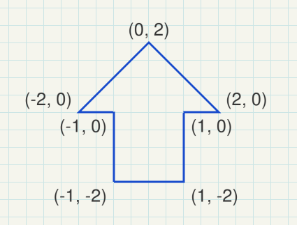
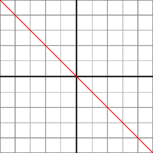
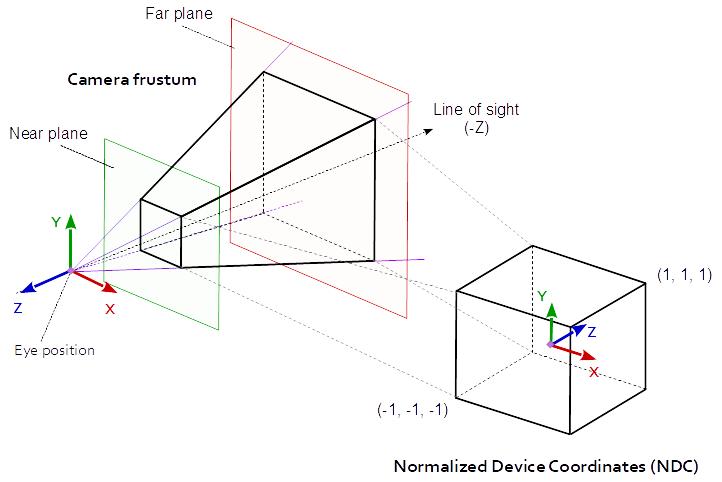
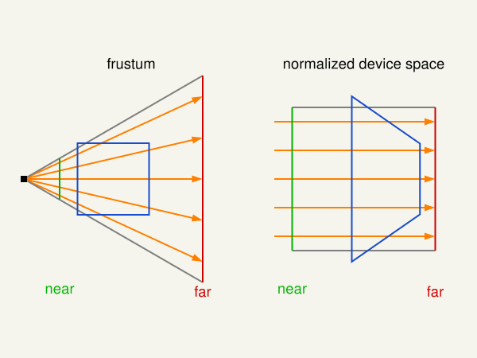
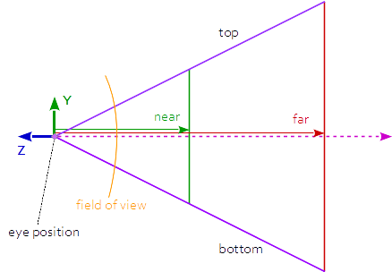

<!-- TOC -->

- [Model, View, Projection and Depth](#model-view-projection-and-depth)
  - [Coordinate Systems](#coordinate-systems)
    - [Model coordinates (Object coordinates)](#model-coordinates-object-coordinates)
    - [World coordinates](#world-coordinates)
      - [Model matrix](#model-matrix)
    - [View space (Eye coordinates)](#view-space-eye-coordinates)
      - [View matrix](#view-matrix)
    - [Clip coordinates](#clip-coordinates)
      - [Projection matrix](#projection-matrix)
    - [Normalized device coordinates](#normalized-device-coordinates)
    - [Window coordinates (Screen coordinates)](#window-coordinates-screen-coordinates)
      - [Viewport and depth range](#viewport-and-depth-range)
  - [View](#view)
  - [Projection](#projection)
    - [Orthographic Clip Space](#orthographic-clip-space)
    - [Perspective Clip Space](#perspective-clip-space)
  - [Depth](#depth)
  - [Orthographic Projection](#orthographic-projection)
  - [Perspective Projection](#perspective-projection)
    - [What the perspective projection does](#what-the-perspective-projection-does)
  - [Depth buffer](#depth-buffer)
  - [Unproject](#unproject)
    - [Unproject - Orthographic Projection](#unproject---orthographic-projection)
    - [Unproject - Perspective Projection](#unproject---perspective-projection)
    - [Perspective Projection - Linearized depth](#perspective-projection---linearized-depth)
  - [3 Solutions to recover view space position in perspective projection](#3-solutions-to-recover-view-space-position-in-perspective-projection)
    - [1. With field of view and aspect](#1-with-field-of-view-and-aspect)
    - [2. With the projection matrix](#2-with-the-projection-matrix)
    - [3. With the inverse projection matrix](#3-with-the-inverse-projection-matrix)
  - [Resources](#resources)

<!-- /TOC -->

# Model, View, Projection and Depth

In a rendering, each mesh of the scene usually is transformed by the model matrix, the view matrix and the projection matrix. Finally the projected scene is mapped to the viewport.

The projection, view and model matrix interact together to present the objects (meshes) of a scene on the viewport.
The model matrix defines the position orientation and scale of a single object (mesh) in the world space of the scene.
The view matrix defines the position and viewing direction of the observer (viewer) within the scene.
The projection matrix defines the area (volume) with respect to the observer (viewer) which is projected onto the viewport.

At orthographic projection, this area (volume) is defined by 6 distances (left, right, bottom, top, near and far) to the viewer's position.
If the left, bottom and near distance are negative and the right, top and far distance are positive (as in normalized device space), this can be imagined as box around the viewer.
All the objects (meshes) which are in the space (volume) are "visible" on the viewport. All the objects (meshes) which are out (or partly out) of this space are clipped at the borders of the volume.
This means at orthographic projection, the objects "behind" the viewer are possibly "visible". This may seem unnatural, but this is how orthographic projection works.

At perspective projection the viewing volume is a [frustum](https://en.wikipedia.org/wiki/Viewing_frustum) (a truncated pyramid), where the top of the pyramid is the viewing position.
The direction of view (line of sight) and the near and the far distance define the planes which truncated the pyramid to a frustum (the direction of view is the normal vector of this planes).
The left, right, bottom, top distance define the distance from the intersection of the line of sight and the near plane, with the side faces of the frustum (on the near plane).
This causes that the scene looks like, as it would be seen from of a pinhole camera.

One of the most common mistakes, when an object is not visible on the viewport (screen is all "black"), is that the mesh is not within the view volume which is defined by the projection and view matrix.

---

## Coordinate Systems

### Model coordinates (Object coordinates)

The model space is the coordinates system, which is used to define or modulate a mesh. The vertex coordinates are defined in model space.

e.g.:



### World coordinates

The world space is the coordinate system of the scene. Different models (objects) can be placed multiple times in the world space to form a scene, in together.

#### Model matrix

The model matrix defines the location, orientation and the relative size of a model (object, mesh) in the scene. The model matrix transforms the vertex positions of a single mesh to world space for a single specific positioning. There are different model matrices, one for each combination of a model (object) and a location of the object in the world space.

The model matrix looks like this:

```txt
( X-axis.x, X-axis.y, X-axis.z, 0 )
( Y-axis.x, Y-axis.y, Y-axis.z, 0 )
( Z-axis.x, Z-axis.y, Z-axis.z, 0 )
( trans.x,  trans.y,  trans.z,  1 )
```

e.g.:

```txt
(  0.0, -0.5,  0.0,  0.0 )
(  2.0,  0.0,  0.0,  0.0 )
(  0.0,  0.0,  1.0,  0.0 )
(  0.4,  0.0,  0.0,  1.0 )
```


### View space (Eye coordinates)

The view space is the local system which is defined by the point of view onto the scene.
The position of the view, the line of sight and the upwards direction of the view, define a coordinate system relative to the world coordinate system. The objects of a scene have to be drawn in relation to the view coordinate system, to be "seen" from the viewing position. The inverse matrix of the view coordinate system is named the **view matrix**. This matrix transforms from world coordinates to view coordinates.  
In general world coordinates and view coordinates are [Cartesian coordinates](https://en.wikipedia.org/wiki/Cartesian_coordinate_system)

#### View matrix
  
The view coordinates system describes the direction and position from which the scene is looked at. The view matrix transforms from the world space to the view (eye) space.

If the coordinate system of the view space is a [Right-handed](https://en.wikipedia.org/wiki/Right-hand_rule) system, where the X-axis points to the left and the Y-axis points up, then the Z-axis points out of the view (Note in a right hand system the Z-Axis is the cross product of the X-Axis and the Y-Axis).


### Clip coordinates

Clip space coordinates are [Homogeneous coordinates](https://en.wikipedia.org/wiki/Homogeneous_coordinates). In clip space the clipping of the scene is performed.  
A point is in clip space if the `x`, `y` and `z` components are in the range defined by the inverted `w` component and the `w` component of the homogeneous coordinates of the point:

```txt
-w <=  x, y, z  <= w.
```

#### Projection matrix

The projection matrix describes the mapping from 3D points of a scene, to 2D points of the viewport. The projection matrix transforms from view space to the clip space. The coordinates in the clip space are transformed to the normalized device coordinates (NDC) in the range (-1, -1, -1) to (1, 1, 1) by dividing with the `w` component of the clip coordinates.

e.g.:

look at: eye position *(2.5, -1.5, 3.5)*, center *(2, 0, 0)*, up vector *(0, 1, 0)*

perspective projection: field of view (y) of *100 degrees*, near plane at *0.1*, far plane at *20.0*


### Normalized device coordinates

The normalized device space is a cube, with right, bottom, front of (-1, -1, -1) and a left, top, back of (1, 1, 1).
The normalized device coordinates are the clip space coordinates divide by the `w` component of the clip coordinates. This is called [Perspective divide](https://www.khronos.org/opengl/wiki/Vertex_Post-Processing#Perspective_divide)


### Window coordinates (Screen coordinates)

The window coordinates are the coordinates of the viewport rectangle. The window coordinates finally are passed to the rasterization process.

#### Viewport and depth range

The normalized device coordinates are linearly mapped to the viewport rectangle (Window Coordinates / Screen Coordinates) and to the depth for the depth buffer.
The viewport rectangle is defined by [`glViewport`](https://www.khronos.org/registry/OpenGL-Refpages/gl4/html/glViewport.xhtml). The depth range is set by [`glDepthRange`](https://www.khronos.org/registry/OpenGL-Refpages/gl4/html/glDepthRange.xhtml) and is by default [0, 1].

See also:
[OpenGL Transformation](http://www.songho.ca/opengl/gl_transform.html)

---

## View

On the viewport the X-axis points to the left, the Y-axis up and the Z-axis out of the view (Note in a right hand system the Z-Axis is the cross product of the X-Axis and the Y-Axis).

The code below defines a matrix that exactly encapsulates the steps necessary to calculate a look at the scene:

- Converting model coordinates into view system coordinates.
- Rotation, to look in the direction of the view.
- Movement to the eye position.

The following code does the same as `gluLookAt` or `glm::lookAt` does:

```cpp
using TVec3  = std::array< float, 3 >;
using TVec4  = std::array< float, 4 >;
using TMat44 = std::array< TVec4, 4 >;

TVec3 Cross( TVec3 a, TVec3 b ) { return { a[1] * b[2] - a[2] * b[1], a[2] * b[0] - a[0] * b[2], a[0] * b[1] - a[1] * b[0] }; }
float Dot( TVec3 a, TVec3 b ) { return a[0]*b[0] + a[1]*b[1] + a[2]*b[2]; }
void Normalize( TVec3 & v )
{
    float len = sqrt( v[0] * v[0] + v[1] * v[1] + v[2] * v[2] );
    v[0] /= len; v[1] /= len; v[2] /= len;
}

TMat44 Camera::LookAt( const TVec3 &pos, const TVec3 &target, const TVec3 &up )
{
    TVec3 mz = { pos[0] - target[0], pos[1] - target[1], pos[2] - target[2] };
    Normalize( mz );
    TVec3 my = { up[0], up[1], up[2] };
    TVec3 mx = Cross( my, mz );
    Normalize( mx );
    my = Cross( mz, mx );

    TMat44 v{
        TVec4{ mx[0], my[0], mz[0], 0.0f },
        TVec4{ mx[1], my[1], mz[1], 0.0f },
        TVec4{ mx[2], my[2], mz[2], 0.0f },
        TVec4{ Dot(mx, pos), Dot(my, pos), -Dot(mz, pos), 1.0f }
    };

    return v;
}
```

[Euclidean length](https://en.wikipedia.org/wiki/Euclidean_distance) of a vector:

```py
def length(v):
    return math.sqrt(v[0]*v[0]+v[1]*v[1]+v[2]*v[2])
```  

[Unit vector](https://en.wikipedia.org/wiki/Unit_vector):

```py
def normalize(v):
    l = length(v)
    return [v[0]/l, v[1]/l, v[2]/l]
``` 

[Dot product](https://en.wikipedia.org/wiki/Dot_product):

```py
def dot(v0, v1):
    return v0[0]*v1[0]+v0[1]*v1[1]+v0[2]*v1[2]
```

[Cross product](https://en.wikipedia.org/wiki/Cross_product):

```py
def cross(v0, v1):
    return [
        v0[1]*v1[2]-v1[1]*v0[2],
        v0[2]*v1[0]-v1[2]*v0[0],
        v0[0]*v1[1]-v1[0]*v0[1]]

```

The following code does the same as [`gluLookAt`](https://www.khronos.org/registry/OpenGL-Refpages/gl2.1/xhtml/gluLookAt.xml) or [`glm::lookAt`](https://glm.g-truc.net/0.9.9/api/a00668.html#gaa64aa951a0e99136bba9008d2b59c78e) does:

The parameter `eye` is the point of view, `target` is the point which is looked at and `up` is the upwards direction.

```py
def m3dLookAt(eye, center, up):
    mz = normalize( (eye[0]-target[0], eye[1]-target[1], eye[2]-target[2]) ) # inverse line of sight
    mx = normalize( cross( up, mz ) )
    my = normalize( cross( mz, mx ) )
    tx =  dot( mx, eye )
    ty =  dot( my, eye )
    tz = -dot( mz, eye )   
    return np.array([mx[0], my[0], mz[0], 0, mx[1], my[1], mz[1], 0, mx[2], my[2], mz[2], 0, tx, ty, tz, 1])
```

Use it like this:

```py
view_position = [0, 0, 20]
view_matrix = m3dLookAt(view_position, [0, 0, 0], [0, 1, 0])
```

---

## Projection

The projection matrix describes the mapping from 3D points of the view on a scene, to 2D points on the viewport. It transforms from eye space to the clip space, and the coordinates in the clip space are transformed to the normalized device coordinates (NDC) by dividing with the `w` component of the clip coordinates. The NDC are in range (-1,-1,-1) to (1,1,1).  
Every geometry which is out of the clip space is clipped.

But, **if the `w` component is negative, then the vertex is clipped**. Because the condition for a homogeneous coordinate to be in clip space is

```txt
-w <=  x, y, z  <= w.
```

If `w = -1` this would mean:

```txt
1 <= x, y, z  <= -1.
```

and that can never be fulfilled.

### Orthographic Clip Space


### Perspective Clip Space

The objects between the near plane and the far plane of the camera frustum are mapped to the range (-1, 1) of the NDC.

The viewing frustum is limited by the near and far plane. The geometry is clipped at the 6 planes of the frustum.


---

## Depth

Whether the depth (`gl_FragCoord.z` and `gl_FragDepth`) is linear mapped or not depends on, the projection matrix.
While for Orthographic Projection the depth is linear, for Perspective Projection it is not linear.

In general, the depth (`gl_FragCoord.z` and `gl_FragDepth`) is calculated as follows:

```glsl
float ndc_depth = clip_space_pos.z / clip_space_pos.w;
float depth = (((farZ-nearZ) * ndc_depth) + nearZ + farZ) / 2.0;
```

---

## Orthographic Projection

At Orthographic Projection, the view space coordinates are linearly mapped to the clip space coordinates. The clip space coordinates are equal to the normalized device coordinates, because the `w` component is 1 (for a cartesian input coordinate).  
The values for left, right, bottom, top, near and far define a box. All the geometry which is inside the volume of the box is "visible" on the viewport.


Orthographic Projection Matrix:

```txt
r = right, l = left, b = bottom, t = top, n = near, f = far

X:    2/(r-l)         0               0               0
y:    0               2/(t-b)         0               0
z:    0               0               -2/(f-n)        0
t:    -(r+l)/(r-l)    -(t+b)/(t-b)    -(f+n)/(f-n)    1
```

At Orthographic Projection, the Z component is calculated by the **linear function**:

```txt
z_ndc = z_eye * -2/(f-n) - (f+n)/(f-n)
```



---

## Perspective Projection

At Perspective Projection the projection matrix describes the mapping from 3D points in the world as they are seen from of a pinhole camera, to 2D points of the viewport.  
The eye space coordinates in the camera frustum (a truncated pyramid) are mapped to a cube (the normalized device coordinates).



A perspective projection matrix can be defined by a **frustum**.  
The distances `left`, `right`, `bottom` and `top`, are the distances from the center of the view to the side faces of the frustum, on the near plane. `near` and `far` specify the distances to the near and far plane of the frustum.

```lang-none
r = right, l = left, b = bottom, t = top, n = near, f = far

x:    2*n/(r-l)      0              0                0
y:    0              2*n/(t-b)      0                0
z:    (r+l)/(r-l)    (t+b)/(t-b)    -(f+n)/(f-n)    -1
t:    0              0              -2*f*n/(f-n)     0
```

If the projection is symmetric, where the line of sight is axis of symmetry of the view frustum, then the matrix can be simplified:

```lang-none
a  = w / h
ta = tan( fov_y / 2 );

2 * n / (r-l) = 1 / (ta * a)
2 * n / (t-b) = 1 / ta
(r+l)/(r-l)   = 0
(t+b)/(t-b)   = 0
```

So the symmetrically perspective projection is:

```lang-none
x:    1/(ta*a)  0      0              0
y:    0         1/ta   0              0
z:    0         0     -(f+n)/(f-n)   -1
t:    0         0     -2*f*n/(f-n)    0
```

The following function will calculate the same projection matrix as `gluPerspective` does:

```cpp
#include <array>

const float cPI = 3.14159265f;
float ToRad( float deg ) { return deg * cPI / 180.0f; }

using TVec4  = std::array< float, 4 >;
using TMat44 = std::array< TVec4, 4 >;

TMat44 Perspective( float fov_y, float aspect )
{
    float fn = far + near
    float f_n = far - near;
    float r = aspect;
    float t = 1.0f / tan( ToRad( fov_y ) / 2.0f );

    return TMat44{
        TVec4{ t / r, 0.0f,  0.0f,                 0.0f },
        TVec4{ 0.0f,  t,     0.0f,                 0.0f },
        TVec4{ 0.0f,  0.0f, -fn / f_n,            -1.0f},
        TVec4{ 0.0f,  0.0f, -2.0f*far*near / f_n,  0.0f }
    };
}
```

At Perspective Projection, the Z component is calculated by the **rational function**:

```cpp
z_ndc = ( -z_eye * (f+n)/(f-n) - 2*f*n/(f-n) ) / -z_eye
```


### What the perspective projection does

- The projection matrix transforms from view space to clip space, respectively normalized device space

- The perspective projection describes the mapping from 3D points in the world as they are seen from of a pinhole camera, to 2D points of the viewport.

But what does that mean?

Imagine a perfect cube, which is looked at with one eye. If the cube is fare away, it appears small. If the cube is close to the eye it appears large or is even not visible completely.  
The perspective projection reflects this behavior.

Send rays from the eye to all directions of the range of vision. Close to the eye, the field, which is penetrated by the rays, is small. As the distance increases, the field becomes larger, square to the distance. The conical volume, which is permeated by the rays, is the view volume.

In computer graphics this volume is not a cone, its base is a rectangle, because of the rectangular viewport. Further there is a near and a far plane, which limits the view volume in its range. This is because of the limited number range, that can be represented by digital computer technology. This truncated pyramid is the perspective view frustum.

The single rays are projected on the pixel of the viewport. Imagine a panel with a hole matrix, as many holes in a row, as pixel in the width of the view and as many holes in a column as pixel in the height of the view. Rays sent from the eye through each hole of the raster, represents the mapping of rays to the pixels on the viewport. The color of the first objected which is hit by a ray is placed at the pixel, which is represented by the ray.

At the left side, the following image shows a cube which is looked at from a eye position and the view frustum. The right part of the image shows the perspective distortion, caused by the projection on the viewport. The plane of the cube which is closer to the view position seems to be larger, than the plane which is further away. The front top and bottom edge of the cube are clipped, because they are not in the view volume and not visible on the viewport.



---

## Depth buffer

Since the normalized device coordinates are in range (-1,-1,-1) to (1,1,1) the Z-coordinate has to be mapped to the depth buffer the range [0,1]:

```cpp
depth = (z_ndc + 1) / 2
```

How the Z component of the normalized device space is mapped to the depth value, can in OpenGL be defined by the function `glDepthRange`. Usually the range is [0, 1], from the near plane to the far plane.

Note, in the fragment shader, the built in input variable `gl_FragCoord` is available, that contains the window relative coordinate (`x`, `y`, `z`, `1/w`) values for the fragment.  
The `z` component contains the depth value, that would be written to `gl_FragDepth`(except the shader code contains explicit writing to it) and is finally the value stored in th depth buffer.

`gl_FragCoord` may be redeclared with the additional layout qualifier identifiers `origin_upper_left` or `pixel_center_integer`. By default, `gl_FragCoord` assumes a lower-left origin for window coordinates and assumes pixel centers are located at half-pixel centers. For example, the (x, y) location (0.5, 0.5) is returned for the lower-left-most pixel in a window. The origin of `gl_FragCoord` may be changed by redeclaring `gl_FragCoord` with the `origin_upper_left` identifier. 

---

## Unproject

To convert form the depth of the depth buffer to the original Z-coordinate, the projection (Orthographic or Perspective), and the near plane and far plane has to be known.

In the following is assumed that the depth range is in [0, 1] and depth is a value in this range:

### Unproject - Orthographic Projection

```txt
n = near, f = far
```

```cpp
z_eye = depth * (f-n) + n;

z_linear = z_eye
```

### Unproject - Perspective Projection

```txt
n = near, f = far
```

```cpp
z_ndc = 2 * depth - 1.0;
z_eye = 2 * n * f / (f + n - z_ndc * (f - n));
```

If the perspective projection matrix is known this can be done as follows:

```cpp
A = prj_mat[2][2]
B = prj_mat[3][2]
z_eye = B / (A + z_ndc)
```

### Perspective Projection - Linearized depth

Convert the depth value or the normalized device z component to a linear value in the range [0.0, 1.0] where 0.0 is near and 1.0 is far.

[How To Linearize the Depth Value](http://www.ozone3d.net/blogs/lab/20090206/how-to-linearize-the-depth-value/)  
[Linear Depth](http://dev.theomader.com/linear-depth/)  
[From linear -> non-linear depth values](https://www.gamedev.net/forums/topic/658957-depth-buffer-from-linear-non-linear-depth-values/)  

```cpp
z_linear = (z_eye - n) / (f - n)
```

Very good approximation for small near values: 

```cpp
z_linear = 2 * n / (f + n - z_ndc * (f - n)) - n) / (f-n)
```

Exact calculation:

```cpp
z_linear = (2 * n * f / (f + n - z_ndc * (f - n)) - n) / (f-n)
```

The relation between the projected area in view space and the Z coordinate of the view space is linear. It depends on the field of view angle and the aspect ratio.



A projected size in normalized device space can be transformed to a size in view space by:

```cpp
aspect = w / h
tanFov = tan(fov_y * 2.0) * 2.0;

size_x = ndx_size_x * z_eye * tanFov * aspect;
size_y = ndx_size_y * z_eye * tanFov;
```

If the perspective projection matrix is known and the projection is symmetrically (the line of sight is in the center of the viewport and the field of view is not displaced), this can be done as follows:

```cpp
size_x = ndx_size_x * / (prj_mat[0][0] * z_eye);
size_y = ndx_size_y * / (prj_mat[1][1] * z_eye);
```

---

## 3 Solutions to recover view space position in perspective projection

### 1. With field of view and aspect

Since the projection matrix is defined by the field of view and the aspect ratio it is possible to recover the viewport position with the field of view and the aspect ratio. Provided that it is a symmetrical perspective projection and the normalized device coordinates, the depth and the near and far plane are known.

Recover the Z distance in view space:

```cpp
z_ndc = 2.0 * depth - 1.0;
z_eye = 2.0 * n * f / (f + n - z_ndc * (f - n));
```

Recover the view space position by the XY normalized device coordinates:

```txt
ndc_x, ndc_y = xy normalized device coordinates in range from (-1, -1) to (1, 1):
```

```cpp
viewPos.x = z_eye * ndc_x * aspect * tanFov;
viewPos.y = z_eye * ndc_y * tanFov;
viewPos.z = -z_eye;
```

### 2. With the projection matrix

The projection parameters, defined by the field of view and the aspect ratio are stored in the projection matrix. Therefore the viewport position can be recovered by the values from the projection matrix, from a symmetrical perspective projection.

Note the relation between projection matrix, field of view and aspect ratio:

```cpp
prjMat[0][0] = 2*n/(r-l) = 1.0 / (tanFov * aspect);
prjMat[1][1] = 2*n/(t-b) = 1.0 / tanFov;

prjMat[2][2] = -(f+n)/(f-n)
prjMat[2][2] = -2*f*n/(f-n)
```

Recover the Z distance in view space:

```cpp
A     = prj_mat[2][2];
B     = prj_mat[3][2];
z_ndc = 2.0 * depth - 1.0;
z_eye = B / (A + z_ndc);
```

Recover the view space position by the XY normalized device coordinates:

```cpp
viewPos.x = z_eye * ndc_x / prjMat[0][0];
viewPos.y = z_eye * ndc_y / prjMat[1][1];
viewPos.z = -z_eye;
```

### 3. With the inverse projection matrix

Of course the viewport position can be recovered by the inverse projection matrix.

```cpp
mat4 inversePrjMat = inverse( prjMat );
vec4 viewPosH      = inversePrjMat * vec3( ndc_x, ndc_y, 2.0 * depth - 1.0, 1.0 )
vec3 viewPos       = viewPos.xyz / viewPos.w;
```

This means the unprojected rectangle with a specific depth, can be calculated like this:

```cpp
vec4 viewLowerLeftH  = inversePrjMat * vec3( -1.0, -1.0, 2.0 * depth - 1.0, 1.0 );
vec4 viewUpperRightH = inversePrjMat * vec3(  1.0,  1.0, 2.0 * depth - 1.0, 1.0 );
vec3 viewLowerLeft   = viewLowerLeftH.xyz / viewLowerLeftH.w;
vec3 viewUpperRight  = viewUpperRightH.xyz / viewUpperRightH.w;
```

---

## Resources

- [OpenGL - Mouse coordinates to Space coordinates](https://stackoverflow.com/questions/46749675/opengl-mouse-coordinates-to-space-coordinates/46752492#46752492)
- [How to render depth linearly in modern OpenGL with gl_FragCoord.z in fragment shader?](https://stackoverflow.com/questions/7777913/how-to-render-depth-linearly-in-modern-opengl-with-gl-fragcoord-z-in-fragment-sh/45710371#45710371)
- [How to find PyGame Window Coordinates of an OpenGL Vertice?](https://stackoverflow.com/questions/46801701/how-to-find-pygame-window-coordinates-of-an-opengl-vertice/46815050#46815050)
- [Transform the modelMatrix](https://stackoverflow.com/questions/46008171/transform-the-modelmatrix/46008573#46008573)
- [Negative values for gl_Position.w?](https://stackoverflow.com/questions/47233771/negative-values-for-gl-position-w/47235404#47235404)
- [Both depth buffer and triangle face orientation are reversed in OpenGL](https://stackoverflow.com/questions/46239078/both-depth-buffer-and-triangle-face-orientation-are-reversed-in-opengl/46239874#46239874)
- [Stretching Issue with Custom View Matrix](https://stackoverflow.com/questions/45645746/stretching-issue-with-custom-view-matrix/45647732#45647732)
- [How to compute the size of the rectangle that is visible to the camera at a given coordinate?](https://stackoverflow.com/questions/46578529/how-to-compute-the-size-of-the-rectangle-that-is-visible-to-the-camera-at-a-give/46586193#46586193)
- [raycasting: how to properly apply a projection matrix?](https://stackoverflow.com/questions/2354821/raycasting-how-to-properly-apply-a-projection-matrix/44874015#44874015)
- [Calculating frustum FOV for a PerspectiveCamera](https://stackoverflow.com/questions/46164180/calculating-frustum-fov-for-a-perspectivecamera/46169212#46169212)
- [Field of view + Aspect Ratio + View Matrix from Projection Matrix (HMD OST Calibration)](https://stackoverflow.com/questions/46182845/field-of-view-aspect-ratio-view-matrix-from-projection-matrix-hmd-ost-calib/46195462#46195462)
- [OpenGL Perspective Projection pixel perfect drawing](https://stackoverflow.com/questions/46280300/opengl-perspective-projection-pixel-perfect-drawing/46285620#46285620)
- [How to recover view space position given view space depth value and ndc xy](https://stackoverflow.com/questions/11277501/how-to-recover-view-space-position-given-view-space-depth-value-and-ndc-xy/46118945#46118945)
- [`gl_FragCoord`](https://www.khronos.org/registry/OpenGL-Refpages/gl4/html/gl_FragCoord.xhtml)
- [`gl_FragDepth`](https://www.khronos.org/registry/OpenGL-Refpages/gl4/html/gl_FragDepth.xhtml)
- [`glDepthRange`](https://www.khronos.org/registry/OpenGL-Refpages/gl4/html/glDepthRange.xhtml)
- [Depth offset in OpenGL](https://stackoverflow.com/questions/45314290/depth-offset-in-opengl/45317626#45317626)
- [Is it possible get which surface of cube will be click in OpenGL?](https://stackoverflow.com/questions/45893277/is-it-possble-get-which-surface-of-cube-will-be-click-in-opengl/45946943#45946943)
- [Mouse picking miss](https://stackoverflow.com/questions/45882951/mouse-picking-miss/45883624#45883624)
- [OpenGL screen coordinates to world coordinates](https://stackoverflow.com/questions/44965202/opengl-screen-coordinates-to-world-coordinates/45000237#45000237)
- [OpenGL ES 2.0: From orthogonal to perspective (card flip effect)](https://stackoverflow.com/questions/47113598/opengl-es-2-0-from-orthogonal-to-perspective-card-flip-effect/47114173#47114173)
- [Transpose z-position from perspective to orthogonal camera in three.js](https://stackoverflow.com/questions/46829113/transpose-z-position-from-perspective-to-orthogonal-camera-in-three-js/47053505#47053505)
- [Is 4th row in model view projection the viewing position?](https://stackoverflow.com/questions/46637247/is-4th-row-in-model-view-projection-the-viewing-position/46639494#46639494)
- [Fast Extraction of Viewing Frustum Planes from the WorldView-ProjectionMatrix](http://gamedevs.org/uploads/fast-extraction-viewing-frustum-planes-from-world-view-projection-matrix.pdf)
- [How to switch between Perspective and Orthographic cameras keeping size of desired object](https://stackoverflow.com/questions/48187416/how-to-switch-between-perspective-and-orthographic-cameras-keeping-size-of-desir/48188014#48188014)
- [webgl - objects disappear when rotating camera](https://stackoverflow.com/questions/48021486/webgl-objects-disappear-when-rotating-camera/48021929#48021929)

- [Median Distance Perspective Projection](http://csc.lsu.edu/~kooima/articles/medianproj/)
- [Projection Matrix Tricks](http://www.terathon.com/gdc07_lengyel.pdf)
- [The Perspective and Orthographic Projection Matrix](https://www.scratchapixel.com/lessons/3d-basic-rendering/perspective-and-orthographic-projection-matrix/building-basic-perspective-projection-matrix)
- [OpenGL 101: Matrices - projection, view, model](https://solarianprogrammer.com/2013/05/22/opengl-101-matrices-projection-view-model/), [GitHub](https://github.com/sol-prog/OpenGL-101)
- [Wikipedia, Viewing frustum](https://en.wikipedia.org/wiki/Viewing_frustum)
- [Projection Matrix Tricks](http://www.terathon.com/gdc07_lengyel.pdf)
- [Calculating the gluPerspective matrix and other OpenGL matrix maths](https://unspecified.wordpress.com/2012/06/21/calculating-the-gluperspective-matrix-and-other-opengl-matrix-maths/)
- [Perspective projections in LH and RH systems](http://www.gamedev.net/page/resources/_/technical/graphics-programming-and-theory/perspective-projections-in-lh-and-rh-systems-r3598)
- [Perspective Texture Mapping](http://chrishecker.com/images/4/41/Gdmtex1.pdf)

---

<a href="https://stackexchange.com/users/7322082/rabbid76"></a>
