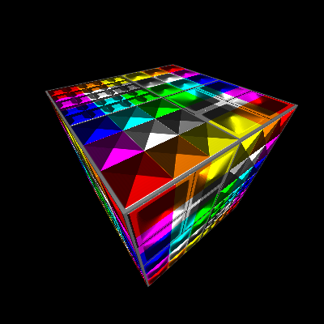
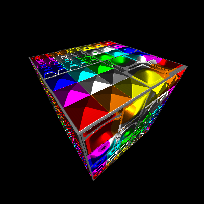
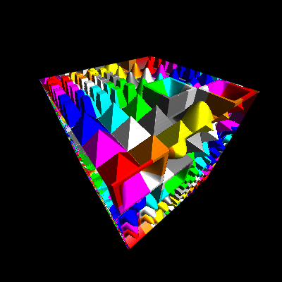
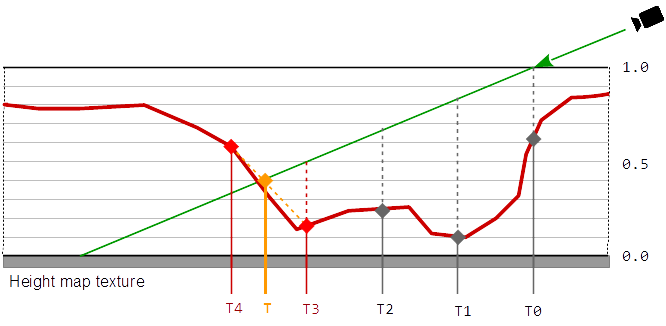
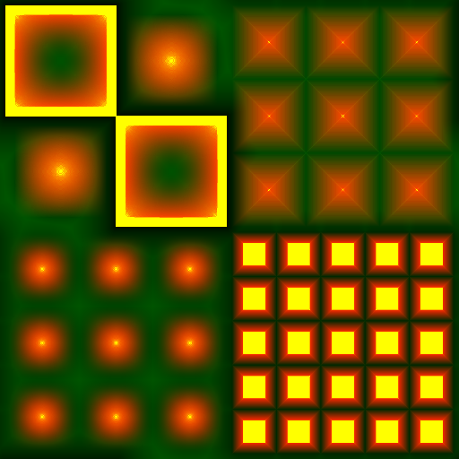

# Normal, Parallax and Relief mapping (under construction)

Textured cube 
[][1]
[][1]

Normal Mapping 
[][2]
[][2]

Offset Limiting 
[][3]
[][3]

Parallax Occlusion Mapping 
[][4]
[][4]

Relief Parallax Mapping 
[][5]
[][5]

Cone Step Mapping 
[][6]
[][6]

Compare the differnt techniques in an **[Example][7]**

 

## Displacement map (Heightmap)

Heightmap 

A heightmap for height field is a raster image which stores the normalized height values of the texels corresponding to a texture. The height values can be used to manipulate the normal vectors of the fragments to visualize bumps and dents. It can even be used to used to displace the fragment, in this case the heightmap is also named displacement map.

 

## Normal map

A normal map is a raster image which stores the normal vectors corresponding to the pixels of a texture, which are caused by bumps and dents. The x, y and z component of the normal vector is either encoded in 3 color channels or the x and y component are encoded in 2 color channel and the z component is assumed to be 1.0. While in the first case, the normal vector can be stored "normalized" and represent the full space. In the second case the normal vector has to be reconstructed and normalized after texture lookup and is limited to a upside down pyramid, but make use of less memory. The slope of the pyramid depends on how the x and y axis are scaled and if the values are stored linear or non linear (e.g. quadratic).

### Normal vector from heightmap

In the following are presented glsl functions, which can directly calculate the normal vector from neighboring height values of a height map.

**High performance, low quality**

    vec4 CalculateNormal( in vec2 texCoords )
    {
        vec2 texOffs = 1.0 / textureSize( u_displacement_map, 0 ).xy;
        vec2 scale   = u_displacement_scale / texOffs;

        vec4  heights = textureGather( u_displacement_map, texCoords, 0 );
        vec2  deltaH  = vec2(dot(heights, vec4(1.0, -1.0, -1.0, 1.0)), dot(heights, vec4(-1.0, -1.0, 1.0, 1.0)));
        float h_mid   = heights.w; 

        return vec4( normalize( vec3( deltaH * scale, 1.0 ) ), h_mid );
    }

**Medium performance, medium quality**

    vec4 CalculateNormal( in vec2 texCoords )
    {
        vec2 texOffs = 1.0 / textureSize( u_displacement_map, 0 ).xy;
        vec2 scale   = u_displacement_scale / texOffs;

        float h_mid  = texture( u_displacement_map, texCoords.st ).r;
        float h_xa   = texture( u_displacement_map, texCoords.st + texOffs * vec2(-1.0,  0.0) ).r;
        float h_xb   = texture( u_displacement_map, texCoords.st + texOffs * vec2( 1.0,  0.0) ).r;
        float h_ya   = texture( u_displacement_map, texCoords.st + texOffs * vec2( 0.0, -1.0) ).r;
        float h_yb   = texture( u_displacement_map, texCoords.st + texOffs * vec2( 0.0,  1.0) ).r;
        vec2  deltaH = vec2(h_xa-h_xb, h_ya-h_yb);  

        return vec4( normalize( vec3( deltaH * scale, 1.0 ) ), h_mid );
    }

**High quality, still acceptable performance**

    vec4 CalculateNormal( in vec2 texCoords )
    {
        vec2 texOffs = 1.0 / textureSize( u_displacement_map, 0 ).xy;
        vec2 scale   = u_displacement_scale / texOffs;

        float hx[9];
        hx[0] = texture( u_displacement_map, texCoords.st + texOffs * vec2(-1.0, -1.0) ).r;
        hx[1] = texture( u_displacement_map, texCoords.st + texOffs * vec2( 0.0, -1.0) ).r;
        hx[2] = texture( u_displacement_map, texCoords.st + texOffs * vec2( 1.0, -1.0) ).r;
        hx[3] = texture( u_displacement_map, texCoords.st + texOffs * vec2(-1.0,  0.0) ).r;
        hx[4] = texture( u_displacement_map, texCoords.st ).r;
        hx[5] = texture( u_displacement_map, texCoords.st + texOffs * vec2( 1.0, 0.0) ).r;
        hx[6] = texture( u_displacement_map, texCoords.st + texOffs * vec2(-1.0, 1.0) ).r;
        hx[7] = texture( u_displacement_map, texCoords.st + texOffs * vec2( 0.0, 1.0) ).r;
        hx[8] = texture( u_displacement_map, texCoords.st + texOffs * vec2( 1.0, 1.0) ).r;
        vec2  deltaH = vec2(hx[0]-hx[2] + 2.0*(hx[3]-hx[5]) + hx[6]-hx[8], hx[0]-hx[6] + 2.0*(hx[1]-hx[7]) + hx[2]-hx[8]); 
        float h_mid  = hx[4]; 

        return vec4( normalize( vec3( deltaH * scale, 1.0 ) ), h_mid );
    }

 

## Normal Mapping

At normal mapping the normal of the fragment is replaced by the normal vector of the normal map (or calculated normal vector from the height map), which is transformed form (co-)tangentspace to view space. This normal vector is used for the light calculations per fragment and causes a good representation of bumps and dents of surfaces with a height displacement a limited range. The algorithm fails at large and sudden changes in the displacement, but is a very performant approach.

    in TVertexData
    {
        vec3 pos;
        vec3 nv;
        vec3 col;
        vec2 uv;
    } in_data;

    out vec4 fragColor;

    uniform vec3  u_lightDir;
    uniform float u_ambient;
    uniform float u_diffuse;
    uniform float u_specular;
    uniform float u_shininess;

    uniform sampler2D u_texture;
    uniform sampler2D u_displacement_map;
    uniform float     u_displacement_scale;
    uniform vec2      u_parallax_quality;

    float CalculateHeight( in vec2 texCoords )
    {
        float height = texture( u_displacement_map, texCoords ).x;
        return clamp( height, 0.0, 1.0 );
    }

    // no parallax, pass through
    vec3 Parallax( in vec3 texDir3D, in vec2 texCoord )
    {
        return vec3(texCoord.xy, 0.0);
    }

    void main()
    {
        vec3  objPosEs     = in_data.pos;
        vec3  objNormalEs  = in_data.nv;
        vec2  texCoords    = in_data.uv.st;
        vec3  normalEs     = ( gl_FrontFacing ? 1.0 : -1.0 ) * normalize( objNormalEs );
        
        // (co-)tangent space
        vec3  N            = normalize( objNormalEs );
        vec3  dp1          = dFdx( objPosEs );
        vec3  dp2          = dFdy( objPosEs );
        vec2  duv1         = dFdx( texCoords );
        vec2  duv2         = dFdy( texCoords );
        vec3  dp2perp      = cross(dp2, N); 
        vec3  dp1perp      = cross(N, dp1);
        vec3  T            = dp2perp * duv1.x + dp1perp * duv2.x;
        vec3  B            = dp2perp * duv1.y + dp1perp * duv2.y;   
        float invmax       = inversesqrt(max(dot(T, T), dot(B, B)));
        mat3  tbnMat       = mat3(T * invmax, B * invmax, N * u_displacement_scale);
      
        // parallax mapping
        vec3  texDir3D     = normalize( inverse( tbnMat ) * objPosEs );
        vec3  newTexCoords = abs(u_displacement_scale) < 0.001 ? vec3(texCoords.st, 0.0) : NoParallax( texDir3D, texCoords.st );
        texCoords.st       = newTexCoords.xy;
        vec4  normalVec    = CalculateNormal( texCoords ); 
        tbnMat[2].xyz     *= (gl_FrontFacing ? 1.0 : -1.0) * N / u_displacement_scale;
        vec3  nvMappedEs   = normalize( tbnMat * normalVec.xyz );

        // texture color
        vec3 color = texture( u_texture, texCoords.st ).rgb;

        // ambient part
        vec3 lightCol = u_ambient * color;

        // diffuse part
        vec3  normalV = normalize( nvMappedEs );
        vec3  lightV  = normalize( -u_lightDir );
        float NdotL   = max( 0.0, dot( normalV, lightV ) );
        lightCol     += NdotL * u_diffuse * color;
        
        // specular part
        vec3  eyeV      = normalize( -objPosEs );
        vec3  halfV     = normalize( eyeV + lightV );
        float NdotH     = max( 0.0, dot( normalV, halfV ) );
        float kSpecular = ( u_shininess + 2.0 ) * pow( NdotH, u_shininess ) / ( 2.0 * 3.14159265 );
        lightCol       += kSpecular * u_specular * color;

        fragColor = vec4( lightCol.rgb, 1.0 );
    }

The code listing above is a general coding for displacement mapping. The different techniques can be applied to the algorithm by changing the function `Parallax`. Further algorithms presented on this page are base on it and only provide different implementation for the `Parallax` function.

 

## Offset Limiting

Offset limiting is one of the simplest parallax techniques. An addtional 3D effect is achieved by adding an offset to the texture coordinates, which dependent on the height (value from the heightmap) of the texel and optional the angle of incidence of the line of sight to the (fragment) surface. The strength of the effect is controlled by a scale value.
This technique can not represent direction dependent self-concealment, but it is very performant, since it can be calculated in an single operation step.

    vec3 Parallax( in vec3 texDir3D, in vec2 texCoord )
    {
        float parallaxScale = 0.1;
        float mapHeight     = CalculateHeight( texCoord.st );
        //vec2  texCoordOffst = parallaxScale * mapHeight * texDir3D.xy / texDir3D.z;
        vec2  texCoordOffst = -parallaxScale * mapHeight * texDir3D.xy;
        return vec3(texCoord.xy + texCoordOffst.xy, mapHeight);
    }

 

## Steep Prallax Mapping and Prallax Occlusion Mapping

The idea of advanced parallax algorithms like "Steep Parallax Mapping", is to displace the fragments of a surface by the corresponding heights from heightmap along the normal vector of the surface (interpolated normal vector of the fragment or normal vector of the primitive face).

At "Steep Parallax Mapping" the line of sight is transformed to the (co-)tangent space, this is the reference system, where the uv-coordinates of a texture form the xy-plane and the z-axis points out of the texture.

Along the projection of the line of sight onto the texture, the heights of the heightmap define a 2 dimensional curve.

The *Steep Parallax* algorithm is used to identify a texel in the texture, by testing sample points along the line of sight.
A texel is found when the normal distance of a sample point to the surface, is less than or equal to the *height* of the texel below the point.

In this calculation, the scaling of the texture does not have to be taken into account since the texture coordinates and the height of the texture are scaled in equal space. 

To find the change of the depth, the displacement along the line of sight has to transformed from tangent space, back to the view space. The change of the depth is the absolute distance between the intersection of the line of sight with the surface and the identified sampling point on the line of sight.

At Parallax Occlusion Mapping the result is improved by a single interpolation between the heights of the last two samples.

    vec3 Parallax( in vec3 texDir3D, in vec2 texCoord )
    {   
        vec2  quality_range   = u_parallax_quality;
        float quality         = mix( quality_range.x, quality_range.y, 1.0 - pow(abs(normalize(texDir3D).z),2.0) );
        float numSteps        = clamp( quality * 50.0, 1.0, 50.0 );
        int   numBinarySteps  = int( clamp( quality * 10.0, 1.0, 7.0 ) );
        
        float surf_sign       = frontFace;
        float back_face       = step(0.0, -surf_sign); 
        vec2  texStep         = surf_sign * texDir3D.xy / abs(texDir3D.z);
        vec2  texC            = texCoord.st + surf_sign * texStep + back_face * texStep.xy; 
        float mapHeight       = 1.0;
        float bestBumpHeight  = mapHeight;
        float bumpHeightStep  = 1.0 / numSteps;
        
        for ( int i = 0; i < int( numSteps ); ++ i )
        {
            mapHeight = back_face + surf_sign * CalculateHeight( texC.xy - bestBumpHeight * texStep.xy );
            if ( mapHeight >= bestBumpHeight )
                break;
            bestBumpHeight -= bumpHeightStep;   
        }
        bestBumpHeight -= bumpHeightStep * clamp( ( bestBumpHeight - mapHeight ) / bumpHeightStep, 0.0, 1.0 );
        mapHeight       = bestBumpHeight;
        texC           -= mapHeight * texStep;
            
        return vec3( texC.xy, mapHeight );
    }

**Reference**

Steep Parallax Mapping - 2005 
[http://graphics.cs.brown.edu/games/SteepParallax/]
[http://graphics.cs.brown.edu/games/SteepParallax/mcguire-steepparallax.pdf]

 

## Relief Parallax Mapping

At Relief Parallax mapping the result of Steep parallax mapping is improved, calculating some binary steps, that approximate the actual height of the intersection. 

    vec3 Parallax( in vec3 texDir3D, in vec2 texCoord )
    {   
        vec2  quality_range   = u_parallax_quality;
        float quality         = mix( quality_range.x, quality_range.y, 1.0 - pow(abs(normalize(texDir3D).z),2.0) );
        float numSteps        = clamp( quality * 50.0, 1.0, 50.0 );
        int   numBinarySteps  = int( clamp( quality * 10.0, 1.0, 7.0 ) );
        
        float surf_sign       = frontFace;
        float back_face       = step(0.0, -surf_sign); 
        vec2  texStep         = surf_sign * texDir3D.xy / abs(texDir3D.z); // (z is negative) the direction vector points downwards int tangent-space
        vec2  texC            = texCoord.st + surf_sign * texStep + back_face * texStep.xy; 
        float mapHeight       = 1.0;
        float bestBumpHeight  = mapHeight;
        float bumpHeightStep  = 1.0 / numSteps;

        for ( int i = 0; i < int( numSteps ); ++ i )
        {
            mapHeight = back_face + surf_sign * CalculateHeight( texC.xy - bestBumpHeight * texStep.xy );
            if ( mapHeight >= bestBumpHeight )
                break;
            bestBumpHeight -= bumpHeightStep;   
        }
        bestBumpHeight += bumpHeightStep;
        for ( int i = 0; i < numBinarySteps; ++ i )
        {
            bumpHeightStep *= 0.5;
            bestBumpHeight -= bumpHeightStep;
            mapHeight       = back_face + surf_sign * CalculateHeight( texC.xy - bestBumpHeight * texStep.xy );
            bestBumpHeight += ( bestBumpHeight < mapHeight ) ? bumpHeightStep : 0.0;
        }
        bestBumpHeight -= bumpHeightStep * clamp( ( bestBumpHeight - mapHeight ) / bumpHeightStep, 0.0, 1.0 );
        mapHeight       = bestBumpHeight;
        texC           -= mapHeight * texStep;
            
        return vec3( texC.xy, mapHeight );
    }

**Reference**

Parallax Occlusion Mapping in GLSL 
[http://sunandblackcat.com/tipFullView.php?topicid=28]

Parallax Occlusion in Direct3D 11 
[http://www.d3dcoder.net/Data/Resources/ParallaxOcclusion.pdf]

Parallax Occlusion Mapping with approximate shadows; Henrik Backlund and Niklas Neijman 
[http://henrikbacklund.se/Reports/Parallax%20Occlusion%20Mapping.pdf]

 

## Cone Step Mapping

    P  ... start of sampling - in (co-)tangent space
    R  ... Line of Sight - normalized direction in (co-)tangent space

    Tx ... Sample point in the heightmap texture - in (co-)tangent space
    h  ... height of the height filed - stored in the heightmap texture
    c  ... gradient of the cone (cone equation: x = c * y) - stored in the heightmap texture

    Q  =  (Tx.x, h) 
    S  =  normalize( (c, 1) )
    
    t  =  dot(Q-P, (S.y, -S.x)) / dot(R, (S.y, -S.x))  =  determinant(mat2(Q-P, S)) / determinant(mat2(R, S))
    u  =  dot(Q-P, (R.y, -R.x)) / dot(R, (S.y, -S.x))  =  determinant(mat2(Q-P, R)) / determinant(mat2(R, S))

    X  =  P + R * t  =  Q + S * u

</>

    vec3 ConeStep( in vec3 texDir3D, in vec2 texCoord )
    {   
        float maxBumpHeight = 1.0;
        vec2  quality_range = u_parallax_quality;
    
        vec2 R = normalize(vec2(length(texDir3D.xy), texDir3D.z)); 
        vec2 P = R * maxBumpHeight / texDir3D.z; 

        vec2 tex_size = textureSize( u_displacement_map, 0 ).xy;
        vec2 min_tex_step = normalize(texDir3D.xy) / tex_size;
        float min_step = length(min_tex_step) * 1.0/R.x;

        float t = 0.0;
        const int max_no_of_steps = 30;
        for ( int i = 0; i < max_no_of_steps; ++ i )
        {
            vec3 sample_pt = vec3(texCoord.xy, maxBumpHeight) + texDir3D * t;

            vec2 h_and_c = GetHeightAndCone( sample_pt.xy );
            float h = h_and_c.x * maxBumpHeight;
            float c = h_and_c.y * h_and_c.y / maxBumpHeight;

            vec2 C = P + R * t;
            if ( C.y <= h )
            break;
            
            vec2 Q = vec2(C.x, h);
            vec2 S = normalize(vec2(c, 1.0));
            float new_t = dot(Q-P, vec2(S.y, -S.x)) / dot(R, vec2(S.y, -S.x));
            t = max(t+min_step, new_t);
        }
        
        vec2  texC = texCoord.xy + texDir3D.xy * t;
        float mapHeight = GetHeightAndCone( texCoord.xy ).x;
        return vec3( texC.xy, mapHeight );
    }

### Cone Step Map generation

The following compute shader can either create a cone map from an heightmap, or it can turn a heightmap into a cone map.
In both cases the floating point height in range [0, 1] has to be stored in the first (red) channel of either the heightmap texture or respectively the cone map image.
The cone map is stored in the second (green) channel. 

    #version 430

    layout(local_size_x = 1, local_size_y = 1) in;

    //#define SOURCE_TEXTURE

    #if defined( SOURCE_TEXTURE )

    // writeonly cone map image
    //layout(binding = 1) writeonly uniform image2D img_output;
    layout(rgba8, binding = 1) writeonly uniform image2D cone_map_image;

    // heightmap source texture
    layout(binding = 2) uniform sampler2D u_height_map;

    // read height from heightmap
    float get_height(in ivec2 coord)
    {
        return texelFetch(u_height_map, coord, 0).x;
    }

    #else

    // read and write cone map image
    layout(rgba8, binding = 1) uniform image2D cone_map_image;

    // read height from image
    float get_height(in ivec2 coord)
    {
        return imageLoad(cone_map_image, coord).x;
    }

    #endif

    const float max_cone_c = 1.0;

    void main()
    {  
        ivec2 pixel_coords = ivec2(gl_GlobalInvocationID.xy);  // get index in global work group i.e x,y position

        ivec2 map_dim  = imageSize(cone_map_image);
        int   cx       = map_dim.x;   
        int   cy       = map_dim.y;  
        int   x        = pixel_coords.x;   
        int   y        = pixel_coords.y;        
        float step_x   = 1.0 / float(cx);
        float step_y   = 1.0 / float(cy);
        float step     = max(step_x, step_y); 
        
        float h        = get_height(pixel_coords);  
        float c        = max_cone_c;
        float max_h    = 1.0 - h;
        float max_dist = min(max_cone_c * max_h, 1.0);

        for( float dist = step; dist <= max_dist && c > dist / max_h; dist += step )
        {
            int   d2       = int(round((dist*dist) / (step*step)));
            int   dy       = int(round(dist / step_y));
            float sample_h = 0;
            for( int dx = 0; sample_h < 1.0 && float(dx) / float(cx) <= dist; ++ dx )
            {
                if ( (dx*dx + dy*dy) < d2 && dy < cy-1 )
                    dy ++;
                do
                {
                    int sx_n = ((cx + x - dx) % cx);
                    int sx_p = ((cx + x + dx) % cx);
                    int sy_n = ((cy + y - dy) % cy);
                    int sy_p = ((cy + y + dy) % cy);
                        
                    sample_h = max( sample_h, get_height(ivec2(sx_p, sy_p)) );
                    sample_h = max( sample_h, get_height(ivec2(sx_p, sy_n)) );
                    sample_h = max( sample_h, get_height(ivec2(sx_n, sy_p)) );
                    sample_h = max( sample_h, get_height(ivec2(sx_n, sy_n)) );

                    dy --;
                }
                while ( dy > 0 && (dx*dx + dy*dy) >= d2 );
            }
            if ( sample_h > h )
            {
                float d_h      = float(sample_h - h);
                float sample_c = dist / d_h; 
                c              = min(c, sample_c);
            }
        }
            
        vec4 cone_map = vec4(h, sqrt(c), 0.0, 0.0);
        
        imageStore(cone_map_image, pixel_coords, cone_map);
    }

Cone map only 

Combined Heightmap and Cone map (red: heightmap, green : cone map) 

**Reference**

Cone Step Mapping: An Iterative Ray-Heightfield Intersection Algorithm, Jonathan "LoneSock" Dummer 
[http://www.lonesock.net/files/ConeStepMapping.pdf]

Relaxed Cone Stepping for Relief Mapping; GPU Gems 3; Fabio Policarpo, Manuel M. Oliveira 
[https://pdfs.semanticscholar.org/e52f/c7648691b9472c60ae17bfb316bb244c5978.pdf]

Anisotropic Cone Mapping; Yu-Jen Chen and Yung-Yu Chuang - National Taiwan University 
[https://www.csie.ntu.edu.tw/~cyy/publications/papers/apsipa2009.pdf]

 

### Protruded Displacement Mapping

**Reference**

Protruded displacement mapping for image-based urban representation 
[https://www.microsoft.com/en-us/research/wp-content/uploads/2016/12/Generalized_Displacement_Maps.pdf]

Silhouette Management for Protruded Displacement Mapping [https://www.researchgate.net/profile/Byounghyun_Yoo/publication/234830509_Silhouette_management_for_protruded_displacement_mapping/links/0c9605264737dd1797000000/Silhouette-management-for-protruded-displacement-mapping.pdf]

 

### Generalized Displacement Mapping

**References**

Generalized Displacement Maps; Eurographics Symposium on Rendering (2004) 
[https://www.microsoft.com/en-us/research/wp-content/uploads/2016/12/Generalized_Displacement_Maps.pdf]

Per Pixel Displacement Mapping - Generalized Displacement Mapping; Enrico Leonhardt [https://www.inf.tu-dresden.de/content/institutes/smt/cg/teaching/seminars/HauptseminarWS0506/public/Enrico%20Leonhardt/GDM.pdf]

Prism Parallax Occlusion Mapping with Accurate Silhouett Generation 
[http://developer.amd.com/wordpress/media/2012/10/Dachsbacher-Tatarchuk-Prism_Parallax_Occlusion_Mapping_with_Accurate_Silhouette_Generation%28SI3D07%29.pdf]

 

## Inverse Displacement Mapping - Relief mapping

**References**

A Prism-Free Method for Silhouette Rendering in Inverse Displacement Mapping; Pacific Graphics 2008; Ying-Chieh Chen and Chun-Fa Chang 
[http://www.cs.nthu.edu.tw/~chunfa/PG08_1258.pdf]

An Efficient Representation for Surface Details; Manuel M. Oliveira and Fabio Policarpo  
[http://citeseerx.ist.psu.edu/viewdoc/download?doi=10.1.1.161.2450&rep=rep1&type=pdf]

Displacement Mapping on the GPU - State of the Art; Laszlo Szirmay-Kalos, Tamas Umenhoffer 
[http://sirkan.iit.bme.hu/~szirmay/egdisfinal3.pdf]

Real-Time Relief Mapping on Arbitrary Polygonal Surfaces; Fabio Policarpo, Manuel M. Oliveira, Joao L. D. Comba 
[https://www.cs.purdue.edu/cgvlab/courses/434/434_Spring_2013/lectures/References/DepthImagesForRenderingSurfaceDetail.pdf]

Relief Mapping of Non-Height-Field Surface Details 
[http://www.inf.ufrgs.br/~oliveira/pubs_files/Policarpo_Oliveira_RTM_multilayer_I3D2006.pdf]

 

## Directional distance maps

**References**

Accurate and Efficient Rendering of Detail using Directional Distance Maps 
[http://www.cs.unc.edu/~ravishm/ICVGIP_2012/docs/mesostructure.pdf]

 

## Impostors

**References**

True Impostors; Eric Risser; University of Central Florida 
[http://www.ericrisser.com/stuff/TrueImpostors.pdf]

 

## Mesostructure

**References**

A hybrid rugosity mesostructure (HRM) for rendering fine haptic detail; Victor Theoktisto Marta Fairen Isabel Navazo 
[https://upcommons.upc.edu/bitstream/handle/2117/86150/R09-5.pdf?sequence=1&isAllowed=y]

 

## Related

**References**

Different Mapping Techniques for Realistic Surfaces 
[http://citeseerx.ist.psu.edu/viewdoc/download?doi=10.1.1.458.9190&rep=rep1&type=pdf]

Displacement Mapping; Studienarbeit Ruth-Maria Recker; Institut fur Computervisualistik Arbeitsgruppe Computergraphik 
[https://www.uni-koblenz.de/~cg/Studienarbeiten/SA_Recker.pdf]

Efficient Self-Shadowed Radiosity Normal Mapping; Chris Green 
[http://www.valvesoftware.com/publications/2007/SIGGRAPH2007_EfficientSelfShadowedRadiosityNormalMapping.pdf]

Fast Soft Self-Shadowing on Dynamic Height Fields; John Snyder and Derek Nowrouzezahrai 
[http://www.cim.mcgill.ca/~derek/files/hfvisib.pdf]

Fast Visualization of Complex 3D Models Using Displacement Mapping 
[https://www.comp.nus.edu.sg/~lowkl/publications/lutk_gi2009.pdf]

Faster Relief Mapping Using the Secant Method 
[https://www.researchgate.net/publication/220494102_Faster_Relief_Mapping_Using_the_Secant_Method]

Frequency Domain Normal Map Filtering; Charles Han Bo Sun Ravi Ramamoorthi Eitan Grinspun; Columbia University 
[http://www.cs.columbia.edu/cg/normalmap/normalmap.pdf]

Gloss and Normal Map Acquisition of Mesostructures Using Gray Codes; Yannick Francken, Tom Cuypers, Tom Mertens, and Philippe Bekaert 
[https://pdfs.semanticscholar.org/494e/64f78c0c1f1d1332708f5b390ed65c38b8db.pdf]

Nvidia GPU Gems 2 Chapter 8 - Per-Pixel Displacement Mapping with Distance Functions 
[http://download.nvidia.com/developer/GPU_Gems_2/GPU_Gems2_ch08.pdf]

Interactive Landscape Visualization Using GPU Ray Casting; Stephan Mantler and Stefan Jeschke; VRVis Research Center Vienna University of Technology 
[https://www.cg.tuwien.ac.at/research/publications/2006/Mantler-06-landscape/Mantler-06-landscape-paper.pdf]

Interactive Rendering of Meso-structure Surface Details using Semi-transparent 3D Textures; Jean-Francois Dufort Luc Leblanc Pierre Poulin 
[http://www.iro.umontreal.ca/~dufortjf/vmv2005.pdf]

Relief Texture Mapping; Dissertation by Manuel Menezes de Oliveira Neto 
[http://www.inf.ufrgs.br/~oliveira/pubs_files/Oliveira_Dissertation_low_res.pdf]

On-GPU ray traced terrain 
[https://kentie.net/article/terrain/ass2_doc_1.pdf]

Relief mapping for urban and natural environments rendering 
[https://bib.irb.hr/datoteka/515699.GVS_34_1037.pdf]

Rendering Geometry with Relief Textures 
[http://www.inf.ufrgs.br/~oliveira/pubs_files/Policarpo_Oliveira_RTM_multilayer_I3D2006.pdf]

Review of Displacement MApping Techniques and Optimizations 
[http://www.diva-portal.org/smash/get/diva2:831762/FULLTEXT01.pdf]

Scalable Height Field Self-Shadowing 
[http://ns1.wili.cc/research/hfshadow/hfshadow.pdf]

Survey of Texture Mapping Techniques for Representing and Rendering Volumetric Mesostructure 
[http://opus.bath.ac.uk/44666/1/Published_version.pdf]

View-Dependent Displacement Mapping 
[https://www.microsoft.com/en-us/research/wp-content/uploads/2016/02/vdm.pdf]

 

# TODO

## Reliefmepping with geometry shader

Reliefmapping on a prism, which is defined by the contur o the triangle primitive  and the minimum and maximum height of the heightmap.
A ray from the view postion to each of the 6 cormers of the prism can be defined. 
The maximum distance for sampling the ray and sarching intersections with the height field, can be limited by 4 planes.
The first 2 lanes ar given by the minimum and maximum haight of the height field. If the ray goes out of this bounds, the sampling can be canceled. No intersection with the height field is found and the view ray hits the prism outside of the silhouette of the height field.
A prism with a triangular base has at most to backfac body surfaces. This 2 surfaces can be identified by the point with the largest distance to the eye position. If the edge trough this point is no silhouette, then there are 2 backface surfaces. For each of the 6 prism corner points the distance to the intersection point with the surfaces along the view ray can be calcualted. This distances can be interpolated for each fragment. The maximum sample distance is given by the closest distance. If the disatance is exceeded, then the view ray hits the prism outside of the silhouette of the height field. This also solves the issue of surfaces at the backface of the prism, because the closest distance will be 0, which means that the ray doesn't hit the height field. The only issue left is to map the distance from the vertex ccordiante space to the texture coordiante space. This can be solved by transforming the vertex points to the (co-)tangent space and measuring the distance in the (co-)tangent space.

This algorithm should well fit with cone step mapping.

  [1]: https://rabbid76.github.io/graphics-snippets/html/technique/parallax_001_no_parallax_mapping.html
  [2]: https://rabbid76.github.io/graphics-snippets/html/technique/parallax_002_normal_mapping.html
  [3]: https://rabbid76.github.io/graphics-snippets/html/technique/parallax_003_offset_limiting.html
  [4]: https://rabbid76.github.io/graphics-snippets/html/technique/parallax_004_parallax_occlusion_mapping_derivative_tbn.html
  [5]: https://rabbid76.github.io/graphics-snippets/html/technique/parallax_005_parallax_relief_mapping_derivative_tbn.html
  [6]: https://rabbid76.github.io/graphics-snippets/html/technique/parallax_006_cone_step_mapping_derivative_tbn.html
  [7]: https://rabbid76.github.io/graphics-snippets/html/technique/parallax_mapping.html
