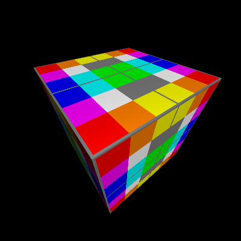
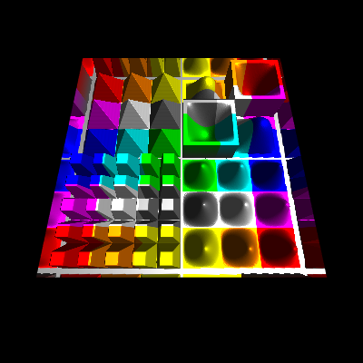
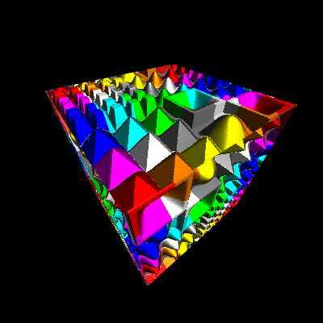
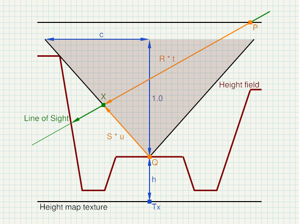

# Normal, Parallax and Relief mapping

Textured cube 
[][1]
[][1]

Normal Mapping 
[][2]
[][2]

Offset Limiting 
[][3]
[][3]

Steep Parallax Mapping 
[][4]
[][4]

Parallax Occlusion Mapping 
[][5]
[][5]

Parallax Occlusion Mapping 
[][6]
[][6]

 

## Displacement map (Height map)

Height map 

Cone map 

TODO

 

## Normal map

TODO

### Normal vector from height map 

**High performance, low quality**

    vec4 CalculateNormal( in vec2 texCoords )
    {
        vec2 texOffs = 1.0 / textureSize( u_displacement_map, 0 ).xy;
        vec2 scale   = u_displacement_scale / texOffs;

        vec4  heights = textureGather( u_displacement_map, texCoords, 0 );
        vec2  deltaH  = vec2(dot(heights, vec4(1.0, -1.0, -1.0, 1.0)), dot(heights, vec4(-1.0, -1.0, 1.0, 1.0)));
        float h_mid   = heights.w; 

        return vec4( normalize( vec3( deltaH * scale, 1.0 ) ), h_mid );
    }

**Medium performance, medium quality**

    vec4 CalculateNormal( in vec2 texCoords )
    {
        vec2 texOffs = 1.0 / textureSize( u_displacement_map, 0 ).xy;
        vec2 scale   = u_displacement_scale / texOffs;

        float h_mid  = texture( u_displacement_map, texCoords.st ).r;
        float h_xa   = texture( u_displacement_map, texCoords.st + texOffs * vec2(-1.0,  0.0) ).r;
        float h_xb   = texture( u_displacement_map, texCoords.st + texOffs * vec2( 1.0,  0.0) ).r;
        float h_ya   = texture( u_displacement_map, texCoords.st + texOffs * vec2( 0.0, -1.0) ).r;
        float h_yb   = texture( u_displacement_map, texCoords.st + texOffs * vec2( 0.0,  1.0) ).r;
        vec2  deltaH = vec2(h_xa-h_xb, h_ya-h_yb);  

        return vec4( normalize( vec3( deltaH * scale, 1.0 ) ), h_mid );
    }

**High quality, still acceptable performance**

    vec4 CalculateNormal( in vec2 texCoords )
    {
        vec2 texOffs = 1.0 / textureSize( u_displacement_map, 0 ).xy;
        vec2 scale   = u_displacement_scale / texOffs;

        float hx[9];
        hx[0] = texture( u_displacement_map, texCoords.st + texOffs * vec2(-1.0, -1.0) ).r;
        hx[1] = texture( u_displacement_map, texCoords.st + texOffs * vec2( 0.0, -1.0) ).r;
        hx[2] = texture( u_displacement_map, texCoords.st + texOffs * vec2( 1.0, -1.0) ).r;
        hx[3] = texture( u_displacement_map, texCoords.st + texOffs * vec2(-1.0,  0.0) ).r;
        hx[4] = texture( u_displacement_map, texCoords.st ).r;
        hx[5] = texture( u_displacement_map, texCoords.st + texOffs * vec2( 1.0, 0.0) ).r;
        hx[6] = texture( u_displacement_map, texCoords.st + texOffs * vec2(-1.0, 1.0) ).r;
        hx[7] = texture( u_displacement_map, texCoords.st + texOffs * vec2( 0.0, 1.0) ).r;
        hx[8] = texture( u_displacement_map, texCoords.st + texOffs * vec2( 1.0, 1.0) ).r;
        vec2  deltaH = vec2(hx[0]-hx[2] + 2.0*(hx[3]-hx[5]) + hx[6]-hx[8], hx[0]-hx[6] + 2.0*(hx[1]-hx[7]) + hx[2]-hx[8]); 
        float h_mid  = hx[4]; 

        return vec4( normalize( vec3( deltaH * scale, 1.0 ) ), h_mid );
    }

 

## Normal Mapping

    in TVertexData
    {
        vec3 pos;
        vec3 nv;
        vec3 col;
        vec2 uv;
    } in_data;

    out vec4 fragColor;

    uniform vec3  u_lightDir;
    uniform float u_ambient;
    uniform float u_diffuse;
    uniform float u_specular;
    uniform float u_shininess;

    uniform sampler2D u_texture;
    uniform sampler2D u_displacement_map;
    uniform float     u_displacement_scale;
    uniform vec2      u_parallax_quality;

    float CalculateHeight( in vec2 texCoords )
    {
        float height = texture( u_displacement_map, texCoords ).x;
        return clamp( height, 0.0, 1.0 );
    }

    // no parallax, pass through
    vec3 Parallax( in vec3 texDir3D, in vec2 texCoord )
    {
        return vec3(texCoord.xy, 0.0);
    }

    void main()
    {
        vec3  objPosEs     = in_data.pos;
        vec3  objNormalEs  = in_data.nv;
        vec2  texCoords    = in_data.uv.st;
        vec3  normalEs     = ( gl_FrontFacing ? 1.0 : -1.0 ) * normalize( objNormalEs );
        
        // (co-)tangent space
        vec3  N           = normalEs;
        vec3  dp1         = dFdx( objPosEs );
        vec3  dp2         = dFdy( objPosEs );
        vec2  duv1        = dFdx( texCoords );
        vec2  duv2        = dFdy( texCoords );
        vec3  dp2perp     = cross(dp2, normalEs); 
        vec3  dp1perp     = cross(normalEs, dp1);
        vec3  T           = dp2perp * duv1.x + dp1perp * duv2.x;
        vec3  B           = dp2perp * duv1.y + dp1perp * duv2.y;   
        float invmax      = inversesqrt(max(dot(T, T), dot(B, B)));
        mat3  tbnMat      = mat3(T * invmax, B * invmax, N);
      
        // parallax mapping
        vec3  texDir3D     = normalize( inverse( tbnMat ) * objPosEs );
        vec3  newTexCoords = NoParallax( texDir3D, texCoords.st );
        texCoords.st       = newTexCoords.xy;
        vec4  normalVec    = CalculateNormal( texCoords ); 
        vec3  nvMappedEs   = normalize( tbnMat * normalVec.xyz );

        // texture color
        vec3 color = texture( u_texture, texCoords.st ).rgb;

        // ambient part
        vec3 lightCol = u_ambient * color;

        // diffuse part
        vec3  normalV = normalize( nvMappedEs );
        vec3  lightV  = normalize( -u_lightDir );
        float NdotL   = max( 0.0, dot( normalV, lightV ) );
        lightCol     += NdotL * u_diffuse * color;
        
        // specular part
        vec3  eyeV      = normalize( -objPosEs );
        vec3  halfV     = normalize( eyeV + lightV );
        float NdotH     = max( 0.0, dot( normalV, halfV ) );
        float kSpecular = ( u_shininess + 2.0 ) * pow( NdotH, u_shininess ) / ( 2.0 * 3.14159265 );
        lightCol       += kSpecular * u_specular * color;

        fragColor = vec4( lightCol.rgb, 1.0 );
    }

 

## Steep Prallax Mapping

    vec3 Parallax( in vec3 texDir3D, in vec2 texCoord )
    {
        float parallaxScale = 0.05;
        float mapHeight     = CalculateHeight( texCoord.st );
        vec2  texCoordOffst = parallaxScale * mapHeight * texDir3D.xy / texDir3D.z;
        return vec3(texCoord.xy + texCoordOffst.xy, mapHeight);
    }

 

## Steep Prallax Mapping

The idea of advanced parallax algorithms like "Steep Parallax Mapping", is to displace the fragments of a surface by the corresponding heights from height map along its normal vectors.

At "Steep Parallax Mapping" the line of sight is transfomed to the (co-)tangent space, this is the reference system, where the uv-coordinates of a texture form the xy-plane and the z-axis points out of the texture.

Along the projection of the line of sight onto the texture, the heights of the height map define a 2 dimensional curve.

The *Steep Parallax* algorithm is used to identify a texel in the texture, by testing sample points along the line of sight.
A texel is found when the normal distance of a sample point to the surface, is less than or equal to the *height* of the texel below the point.

In this calculation, the scaling of the texture does not have to be taken into account since the texture coordinates and the height of the texture are scaled in equal space. 
This is different when calculating the depth (e.g. depth-dependent shadow).
The change in depth is the absolute distance between the intersection of the line of sight with the surface and the identified sampling point on the line of sight.
The absolute distance changes proportionally with the reciprocal scaling factor of the texture.

    vec3 Parallax( in vec3 texDir3D, in vec2 texCoord )
    {   
        float mapHeight;
        float maxBumpHeight = u_displacement_scale;
        vec2  quality_range = u_parallax_quality;
        if ( maxBumpHeight > 0.0 && texDir3D.z < 0.9994 )
        {
            float quality         = mix( quality_range.x, quality_range.y , gl_FragCoord.z * gl_FragCoord.z );
            float numSteps        = clamp( quality * mix( 5.0, 10.0 * clamp( 1.0 + 30.0 * maxBumpHeight, 1.0, 4.0 ), 1.0 - abs(texDir3D.z) ), 1.0, 50.0 );
            int   numBinarySteps  = int( clamp( quality * 5.1, 1.0, 7.0 ) );
            vec2  texDir          = -texDir3D.xy / texDir3D.z;
            //texCoord.xy          += texDir * maxBumpHeight / 2.0;
            texCoord.xy          += texDir * maxBumpHeight;
            vec2  texStep         = texDir * maxBumpHeight;
            float bumpHeightStep  = 1.0 / numSteps;
            mapHeight             = 1.0;
            float bestBumpHeight  = 1.0;
            for ( int i = 0; i < int( numSteps ); ++ i )
            {
                mapHeight = CalculateHeight( texCoord.xy - bestBumpHeight * texStep.xy );
                if ( mapHeight >= bestBumpHeight )
                    break;
                bestBumpHeight -= bumpHeightStep;
            }
            bestBumpHeight += bumpHeightStep * (1.0 - clamp( ( bestBumpHeight - mapHeight ) / bumpHeightStep, 0.0, 1.0 ));
            mapHeight       = bestBumpHeight;
            texCoord       -= mapHeight * texStep;
        }
        else 
            mapHeight = CalculateHeight( texCoord.xy );
        return vec3( texCoord.xy, mapHeight );
    }

 

## Prallax Occlusion Mapping

    vec3 ParallaxOcclusion( in vec3 texDir3D, in vec2 texCoord )
    {   
        float mapHeight;
        float maxBumpHeight = u_displacement_scale;
        vec2  quality_range = u_parallax_quality;
        if ( maxBumpHeight > 0.0 && texDir3D.z < 0.9994 )
        {
            float quality         = mix( quality_range.x, quality_range.y , gl_FragCoord.z * gl_FragCoord.z );
            float numSteps        = clamp( quality * mix( 5.0, 10.0 * clamp( 1.0 + 30.0 * maxBumpHeight, 1.0, 4.0 ), 1.0 - abs(texDir3D.z) ), 1.0, 50.0 );
            int   numBinarySteps  = int( clamp( quality * 5.1, 1.0, 7.0 ) );
            vec2  texDir          = -texDir3D.xy / texDir3D.z;
            //texCoord.xy          += texDir * maxBumpHeight / 2.0;
            texCoord.xy          += texDir * maxBumpHeight;
            vec2  texStep         = texDir * maxBumpHeight;
            float bumpHeightStep  = 1.0 / numSteps;
            mapHeight             = 1.0;
            float bestBumpHeight  = 1.0;
            for ( int i = 0; i < int( numSteps ); ++ i )
            {
                mapHeight = CalculateHeight( texCoord.xy - bestBumpHeight * texStep.xy );
                if ( mapHeight >= bestBumpHeight )
                    break;
                bestBumpHeight -= bumpHeightStep;
            }
            bestBumpHeight += bumpHeightStep;
            for ( int i = 0; i < numBinarySteps; ++ i )
            {
                bumpHeightStep *= 0.5;
                bestBumpHeight -= bumpHeightStep;
                mapHeight       = CalculateHeight( texCoord.xy - bestBumpHeight * texStep.xy );
                bestBumpHeight += ( bestBumpHeight < mapHeight ) ? bumpHeightStep : 0.0;
            }
            bestBumpHeight -= bumpHeightStep * clamp( ( bestBumpHeight - mapHeight ) / bumpHeightStep, 0.0, 1.0 );
            mapHeight       = bestBumpHeight;
            texCoord       -= mapHeight * texStep;
        }
        else 
            mapHeight = CalculateHeight( texCoord.xy );
        return vec3( texCoord.xy, mapHeight );
    }

**Reference**

[Parallax Occlusion Mapping in GLSL](http://sunandblackcat.com/tipFullView.php?topicid=28) 

 

## Cone Step Mapping

    P  ... start of sampling - in (co-)tangent space
    R  ... Line of Sight - normalized direction in (co-)tangent space

    Tx ... Sample point in the height map texture - in (co-)tangent space
    h  ... height of the height filed - stored in the height map texture
    c  ... gradient of the cone (cone equation: x = c * y) - stored in the height map texture

    Q  =  (Tx.x, h) 
    S  =  normalize( (c, 1) )
    
    t  =  dot(Q-P, (S.y, -S.x)) / dot(R, (S.y, -S.x))  =  determinant(mat2(Q-P, S)) / determinant(mat2(R, S))
    u  =  dot(Q-P, (R.y, -R.x)) / dot(R, (S.y, -S.x))  =  determinant(mat2(Q-P, R)) / determinant(mat2(R, S))

    X  =  P + R * t  =  Q + S * u

</>

    vec3 ConeStep( in vec3 texDir3D, in vec2 texCoord )
    {   
        float mapHeight;
        float maxBumpHeight = u_displacement_scale;
        vec2  quality_range = u_parallax_quality;
        if ( maxBumpHeight > 0.0 && texDir3D.z < 0.9994 )
        {
            vec2 R = normalize(vec2(length(texDir3D.xy), texDir3D.z)); 
            vec2 P = R * maxBumpHeight / texDir3D.z; 

            vec2 tex_size = textureSize( u_displacement_map, 0 ).xy;
            vec2 min_tex_step = normalize(texDir3D.xy) / tex_size;
            float min_step = length(min_tex_step) * 1.0/R.x;
            
            float t = 0.0;
            const int max_no_of_steps = 10;
            for ( int i = 0; i < max_no_of_steps; ++ i )
            {
                vec3 sample_pt = vec3(texCoord.xy, maxBumpHeight) + texDir3D * t;

                vec2 h_and_c = GetHeightAndCone( sample_pt.xy );
                float h = h_and_c.x * maxBumpHeight;
                float c = h_and_c.y * h_and_c.y / maxBumpHeight;

                vec2 C = P + R * t;
                if ( C.y <= h )
                    break;
                
                vec2 Q = vec2(C.x, h);
                vec2 S = normalize(vec2(c, 1.0));
                float new_t = dot(Q-P, vec2(S.y, -S.x)) / dot(R, vec2(S.y, -S.x));
                t = max(t+min_step, new_t);
            }
            texCoord.xy = texCoord.xy + texDir3D.xy * t;
        }
        mapHeight = GetHeightAndCone( texCoord.xy ).x;
        return vec3( texCoord.xy, mapHeight );
    }

**Reference**

[Cone Step Mapping: An Iterative Ray-Heightfield Intersection Algorithm, Jonathan ?LoneSock? Dummer](http://www.lonesock.net/files/ConeStepMapping.pdf) 
[Relaxed Cone Stepping for Relief Mapping; GPU Gems 3; Fabio Policarpo, Manuel M. Oliveira](https://pdfs.semanticscholar.org/e52f/c7648691b9472c60ae17bfb316bb244c5978.pdf) 
[Anisotropic Cone Mapping; Yu-Jen Chen and Yung-Yu Chuang - National Taiwan University](https://www.csie.ntu.edu.tw/~cyy/publications/papers/apsipa2009.pdf) 

 

### Proturded Displacement Mapping

**Reference**

[Protruded displacement mapping for image-based urban representation](https://www.microsoft.com/en-us/research/wp-content/uploads/2016/12/Generalized_Displacement_Maps.pdf) 
[Silhouette Management for Protruded Displacement Mapping](https://www.researchgate.net/profile/Byounghyun_Yoo/publication/234830509_Silhouette_management_for_protruded_displacement_mapping/links/0c9605264737dd1797000000/Silhouette-management-for-protruded-displacement-mapping.pdf) 

 

### Generalized Displacement Mapping

**References**

[Generalized Displacement Maps; Eurographics Symposium on Rendering (2004)](https://www.microsoft.com/en-us/research/wp-content/uploads/2016/12/Generalized_Displacement_Maps.pdf) 
[Per Pixel Displacement Mapping - Generalized Displacement Mapping; Enrico Leonhardt](https://www.inf.tu-dresden.de/content/institutes/smt/cg/teaching/seminars/HauptseminarWS0506/public/Enrico%20Leonhardt/GDM.pdf) 

 

## Inverse Displacement Mapping

**References**

[A Prism-Free Method for Silhouette Rendering in Inverse Displacement Mapping; Pacific Graphics 2008](http://www.cs.nthu.edu.tw/~chunfa/PG08_1258.pdf) 
[Displacement Mapping on the GPU - State of the Art](http://sirkan.iit.bme.hu/~szirmay/egdisfinal3.pdf) 
[Generalized Displacement Maps; Eurographics Symposium on Rendering (2004)](https://www.microsoft.com/en-us/research/wp-content/uploads/2016/12/Generalized_Displacement_Maps.pdf) 

 

# TODO

## Reliefmepping with geometry shader

Reliefmapping on a prism, which is defined by the contur o the triangle primitive  and the minimum and maximum height of the height map.
A ray from the view postion to each of the 6 cormers of the prism can be defined. 
The maximum distance for sampling the ray and sarching intersections with the height field, can be limited by 4 planes.
The first 2 lanes ar given by the minimum and maximum haight of the height field. If the ray goes out of this bounds, the sampling can be canceled. No intersection with the height field is found and the view ray hits the prism outside of the silhouette of the height field.
A prism with a triangular base has at most to backfac body surfaces. This 2 surfaces can be identified by the point with the largest distance to the eye position. If the edge trough this point is no silhouette, then there are 2 backface surfaces. For each of the 6 prism corner points the distance to the intersection point with the surfaces along the view ray can be calcualted. This distances can be interpolated for each fragment. The maximum sample distance is given by the closest distance. If the disatance is exceeded, then the view ray hits the prism outside of the silhouette of the height field. This also solves the issue of surfaces at the backface of the prism, because the closest distance will be 0, which means that the ray doesn't hit the height field. The only issue left is to map the distance from the vertex ccordiante space to the texture coordiante space. This can be solved by transforming the vertex points to the (co-)tangent space and measuring the distance in the (co-)tangent space.

This algorithm should well fit with cone step mapping.

  [1]: https://rabbid76.github.io/graphics-snippets/html/technique/parallax_001_no_parallax_mapping.html
  [2]: https://rabbid76.github.io/graphics-snippets/html/technique/parallax_002_normal_mapping.html
  [3]: https://rabbid76.github.io/graphics-snippets/html/technique/parallax_003_offset_limiting.html
  [4]: https://rabbid76.github.io/graphics-snippets/html/technique/parallax_004_steep_parallax_mapping_derivative_tbn.html
  [5]: https://rabbid76.github.io/graphics-snippets/html/technique/parallax_005_parallax_occlusion_mapping_derivative_tbn.html
  [6]: https://rabbid76.github.io/graphics-snippets/html/technique/parallax_006_cone_step_mapping_derivative_tbn.html
