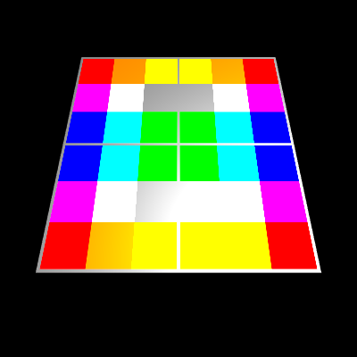
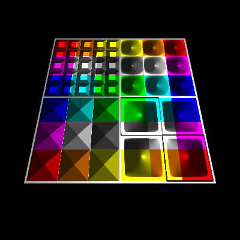
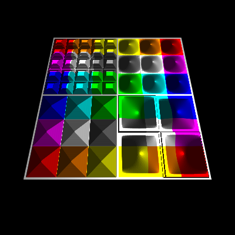
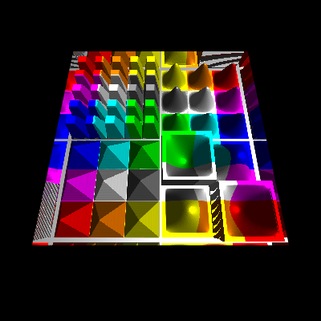
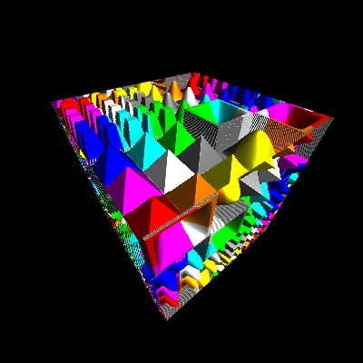

# Normal, Parallax and Relief mapping

Textured cube 
[][1]
[][1]

Normal Mapping 
[][2]
[][2]

Offset Limiting 
[][3]
[][3]

Steep Parallax Mapping 
[][4]
[][4]

Parallax Occlusion Mapping 
[][5]
[][5]

# TODO

## Reliefmepping with geometry shader

Reliefmapping on a prism, which is defined by the contur o the triangle primitive  and the minimum and maximum height of the height map.
A ray from the view postion to each of the 6 cormers of the prism can be defined. 
The maximum distance for sampling the ray and sarching intersections with the height field, can be limited by 4 planes.
The first 2 lanes ar given by the minimum and maximum haight of the height field. If the ray goes out of this bounds, the sampling can be canceled. No intersection with the height field is found and the view ray hits the prism outside of the silhouette of the height field.
A prism with a triangular base has at most to backfac body surfaces. This 2 surfaces can be identified by the point with the largest distance to the eye position. If the edge trough this point is no silhouette, then there are 2 backface surfaces. For each of the 6 prism corner points the distance to the intersection point with the surfaces along the view ray can be calcualted. This distances can be interpolated for each fragment. The maximum sample distance is given by the closest distance. If the disatance is exceeded, then the view ray hits the prism outside of the silhouette of the height field. This also solves the issue of surfaces at the backface of the prism, because the closest distance will be 0, which means that the ray doesn't hit the height field. The only issue left is to map the distance from the vertex ccordiante space to the texture coordiante space. This can be solved by transforming the vertex points to the (co-)tangent space and measuring the distance in the (co-)tangent space.

This algorithm should well fit with cone step mapping.

  [1]: https://rabbid76.github.io/graphics-snippets/html/technique/parallax_001_no_parallax_mapping.html
  [2]: https://rabbid76.github.io/graphics-snippets/html/technique/parallax_002_normal_mapping.html
  [3]: https://rabbid76.github.io/graphics-snippets/html/technique/parallax_003_offset_limiting.html
  [4]: https://rabbid76.github.io/graphics-snippets/html/technique/parallax_004_steep_parallax_mapping_derivative_tbn.html
  [5]: https://rabbid76.github.io/graphics-snippets/html/technique/parallax_005_parallax_occlusion_mapping_derivative_tbn.html
