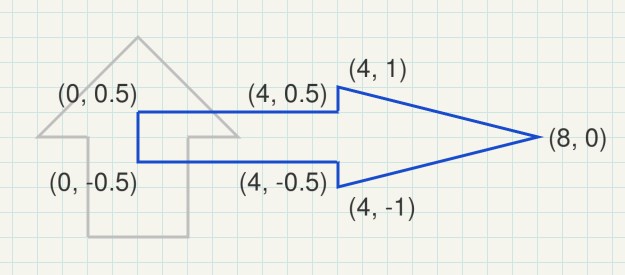
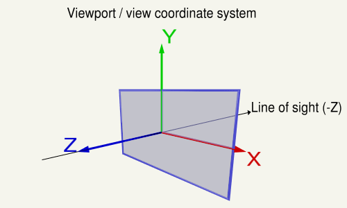
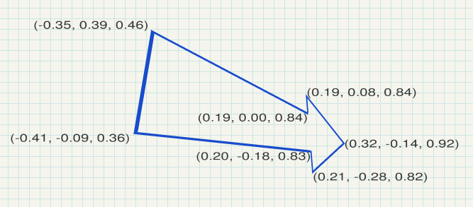
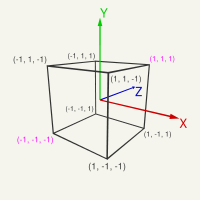
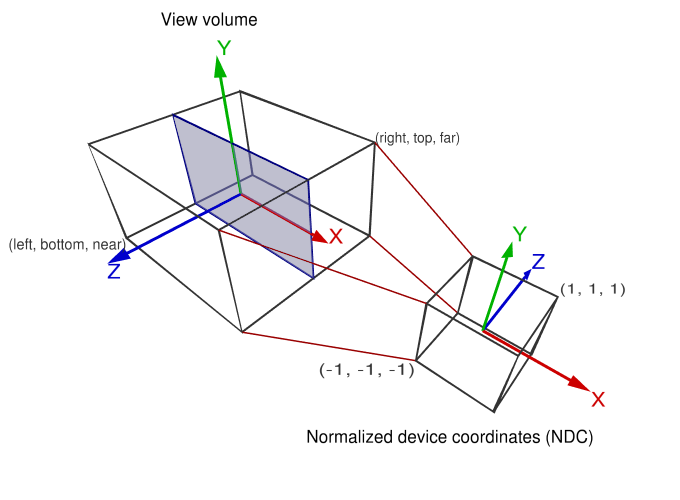
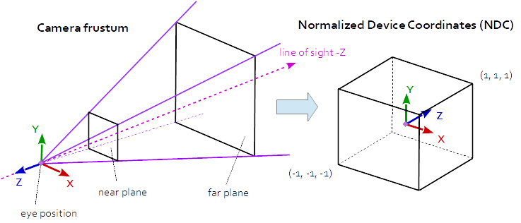
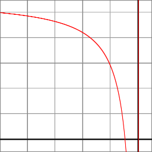

# Projection, View, Model and Depth

In a rendering, each mesh of the scene usually is transformed by the model matrix, the view matrix and the projection matrix. Finall the projected scene is mapped to the viewport.

## Coordiante Systems

### Model coordinates (Object coordinates)

The model space is the local space, where within a mesh is defined. The vertex coordinates are defined in model space.

e.g.:

### World coordinates

The world sapce is the coordinate system of the scene. Different models (objects) can be placed multiple times in the world space to form a scene, in together.

**Model matrix**

The model matrix defines the location, oriantation and the relative size of a model (object, mesh) in the scene. The model matrix transforms the vertex positions of a single mesh to world space for a single specific positioning. There are different model matrices, one for each combination of a model (object) and a location of the object in the wolrd space.

The model matrix looks like this:

    ( X-axis.x, X-axis.y, X-axis.z, 0 )
    ( Y-axis.x, Y-axis.y, Y-axis.z, 0 )
    ( Z-axis.x, Z-axis.y, Z-axis.z, 0 )
    ( trans.x,  trans.y,  trans.z,  1 )

e.g.:

    (  0.0, -0.5,  0.0,  0.0 )
    (  2.0,  0.0,  0.0,  0.0 )
    (  0.0,  0.0,  1.0,  0.0 )
    (  0.4,  0.0,  0.0,  1.0 )

    

### View sapce (Eye coordinates)

The view space is the local system which is defined by the point of view onto the scene.
The position of the view, the line of sight and the upwards direction of the view, define a coordinate system relative to the world coordinate system. The objects of a scene have to be drawn in relation to the view coordinate system, to be "seen" from the viewing position. The inverse matrix of the view coordinate system is named the **view matrix**. 
In general world coordinates and view coordinates are [Cartesian coordinates](https://en.wikipedia.org/wiki/Cartesian_coordinate_system)

**View matrix**
  
The view coordinates system describes the direction and position from which the scene is looked at. The view matrix transforms from the wolrd space to the view (eye) space. 

If the coordiante system of the view space is a [Right-handed](https://en.wikipedia.org/wiki/Right-hand_rule) system, then the X-axis points to the left, the Y-axis up and the Z-axis out of the view (Note in a right hand system the Z-Axis is the cross product of the X-Axis and the Y-Axis). 

 

### Clip coordinates

Clip space coordinates are [Homogeneous coordinates](https://en.wikipedia.org/wiki/Homogeneous_coordinates). In clipspace the clipping of the scene is performed. 
A point is in clip space if the `x`, `y` and `z` components are in the range defined by the inverted `w` component and the `w` component of the homogeneous coordinates of the point:

    -w <=  x, y, z  <= w.

**Projection matrix**

The projection matrix describes the mapping from 3D points of a scene, to 2D points of the viewport. The projection matrix transforms from view space to the clip space. The coordinates in the clip space are transformed to the normalized device coordinates (NDC) in the range (-1, -1, -1) to (1, 1, 1) by dividing with the `w` component of the clip coordinates.

e.g.:

look at: eye position *(2.5, -1.5, 3.5)*, center *(2, 0, 0)*, up vector *(0, 1, 0)*

perspcetive projection: field of view (y) of *100° degrees*, near plane at *0.1*, far plane at *20.0* 

### Normaliced device coordinates

The normalized device coordinates are the clip space coordinates divide by the `w` component of the clip coordinates. This is called [Perspective divide](https://www.khronos.org/opengl/wiki/Vertex_Post-Processing#Perspective_divide)

### Window coordinates (Screen coordinates)

The window coordinates are the coordinates of the viewport rectangle. The window coordinates finally are passed to the raterization process.

**Viewport and depthrange**

The normalized device coordinates are linearly mapped to the Window Coordinates (Screen Coordinates) and to the depth for the depth buffer.
The viewport is defined by [`glViewport`](https://www.khronos.org/registry/OpenGL-Refpages/gl4/html/glViewport.xhtml). The depthrange is set by [`glDepthRange`](https://www.khronos.org/registry/OpenGL-Refpages/gl4/html/glDepthRange.xhtml) and is by default [0, 1].

 
See also:
[OpenGL Transformation](http://www.songho.ca/opengl/gl_transform.html)  

 

## View

On the viewport the X-axis points to the left, the Y-axis up and the Z-axis out of the view (Note in a right hand system the Z-Axis is the cross product of the X-Axis and the Y-Axis).

The code below defines a matrix that exactly encapsulates the steps necessary to calculate a look at the scene:

- Converting model coordinates into viewport coordinates.
- Rotation, to look in the direction of the view.
- Movement to the eye position     

The following code does the same as `gluLookAt` or `glm::lookAt` does:

    using TVec3  = std::array< float, 3 >;
    using TVec4  = std::array< float, 4 >;
    using TMat44 = std::array< TVec4, 4 >;

    TVec3 Cross( TVec3 a, TVec3 b ) { return { a[1] * b[2] - a[2] * b[1], a[2] * b[0] - a[0] * b[2], a[0] * b[1] - a[1] * b[0] }; }
    float Dot( TVec3 a, TVec3 b ) { return a[0]*b[0] + a[1]*b[1] + a[2]*b[2]; }
    void Normalize( TVec3 & v )
    {
        float len = sqrt( v[0] * v[0] + v[1] * v[1] + v[2] * v[2] );
        v[0] /= len; v[1] /= len; v[2] /= len;
    }

    TMat44 Camera::LookAt( const TVec3 &pos, const TVec3 &target, const TVec3 &up )
    { 
        TVec3 mz = { pos[0] - target[0], pos[1] - target[1], pos[2] - target[2] };
        Normalize( mz );
        TVec3 my = { up[0], up[1], up[2] };
        TVec3 mx = Cross( my, mz );
        Normalize( mx );
        my = Cross( mz, mx );
  
        TMat44 v{
            TVec4{ mx[0], my[0], mz[0], 0.0f },
            TVec4{ mx[1], my[1], mz[1], 0.0f },
            TVec4{ mx[2], my[2], mz[2], 0.0f },
            TVec4{ Dot(mx, pos), Dot(my, pos), -Dot(mz, pos), 1.0f }
        };
  
        return v;
    }

 

## Projection

The projection matrix describes the mapping from 3D points of a scene, to 2D points of the viewport. It transforms from eye space to the clip space, and the coordinates in the clip space are transformed to the normalized device coordinates (NDC) by dividing with the `w` component of the clip coordinates. The NDC are in range (-1,-1,-1) to (1,1,1).  Every geometry which is out of the clippspace is clipped. 

But, **if the `w` component is negative, then the vertex is clipped**. Because the condition for a homogeneous coordinate to be in clip space is 

    -w <=  x, y, z  <= w.

If `w = -1` this would mean:

     1 <= x, y, z  <= -1.

and that can never be fulfilled.

**Orthographic Clip Space**

**Perspective Clip Space**

The objects between the near plane and the far plane of the camera frustum are mappend to the range (-1, 1) of the NDC. 

 

## Depth

Whether the depth (`gl_FragCoord.z` and `gl_FragDepth`) is linear mapped or not depends on, the projection matrix.
While for Orthographic Projection the depth is linear, for Perspective Projection it is not linear.

In general, the depth (`gl_FragCoord.z` and `gl_FragDepth`) is calculated as follows:

    float ndc_depth = clip_space_pos.z / clip_space_pos.w;
    float depth = (((farZ-nearZ) * ndc_depth) + nearZ + farZ) / 2.0;

 

## Orthographic Projection

At Orthographic Projection the coordinates in the eye space are linearly mapped to normalized device coordinates and the clip sapce coordinates are equal the normalized device coordiantes, because the `w` component is 1 (for a carthesian coordinate).

Orthographic Projection Matrix:
 
    r = right, l = left, b = bottom, t = top, n = near, f = far 

    2/(r-l)         0               0               0
    0               2/(t-b)         0               0
    0               0               -2/(f-n)        0
    -(r+l)/(r-l)    -(t+b)/(t-b)    -(f+n)/(f-n)    1
    
At Orthographic Projection, the Z component is calcualted by the **linear function**:

    z_ndc = z_eye * -2/(f-n) - (f+n)/(f-n)

 

## Perspective Projection

At Perspective Projection the projection matrix describes the mapping from 3D points in the world as they are seen from of a pinhole camera, to 2D points of the viewport.   The eye space coordinates in the camera frustum (a truncated pyramid) are mapped to a cube (the normalized device coordinates). 

Perspective Projection Matrix:

    r = right, l = left, b = bottom, t = top, n = near, f = far

    2*n/(r-l)      0              0                0
    0              2*n/(t-b)      0                0
    (r+l)/(r-l)    (t+b)/(t-b)    -(f+n)/(f-n)    -1    
    0              0              -2*f*n/(f-n)     0

where :

    a = w / h
    ta = tan( fov_y / 2 );
   
    2 * n / (r-l) = 1 / (ta * a)
    2 * n / (t-b) = 1 / ta

If the projection is symmetric, where the line of sight is in the center of the view port and the field of view is not displaced, then the matrix can be simplified:

    1/(ta*a)  0     0              0
    0         1/ta  0              0
    0         0    -(f+n)/(f-n)   -1    
    0         0    -2*f*n/(f-n)    0

 
The following function will calculate the same projection matrix as `gluPerspective` does:

    #include <array>

    const float cPI = 3.14159265f;
    float ToRad( float deg ) { return deg * cPI / 180.0f; }

    using TVec4  = std::array< float, 4 >;
    using TMat44 = std::array< TVec4, 4 >;

    TMat44 Perspective( float fov_y, float aspect )
    {
        float fn = far + near
        float f_n = far - near;
        float r = aspect;
        float t = 1.0f / tan( ToRad( fov_y ) / 2.0f );
    
        return TMat44{ 
            TVec4{ t / r, 0.0f,  0.0f,                 0.0f },
            TVec4{ 0.0f,  t,     0.0f,                 0.0f },
            TVec4{ 0.0f,  0.0f, -fn / f_n,            -1.0f},
            TVec4{ 0.0f,  0.0f, -2.0f*far*near / f_n,  0.0f }
        };
    }

At Perspective Projection, the Z component is calcualted by the **rational function**:

    z_ndc = ( -z_eye * (f+n)/(f-n) - 2*f*n/(f-n) ) / -z_eye

 

## Depth buffer

Since the normalized device coordinates are in range (-1,-1,-1) to (1,1,1) the Z-coordinate has to be mapped to the depth buffern the range [0,1]:

    depth = (z_ndc + 1) / 2 

How the Z component of the normalized device space is mapped to the depth value, can in OpenGL be defined by the function `glDepthRange`. Usually the range is [0, 1], from the near plane to the far plane.

Note, in the fragment shader, the built in input variable `gl_FragCoord` is available, that contains the window relative coordinate (`x`, `y`, `z`, `1/w`) values for the fragment.  
The `z` component contains the depth value, that would be written to `gl_FragDepth`(except the shader code contains explicit writing to it) and is finally the value stored in th depth buffer.

`gl_FragCoord` may be redeclared with the additional layout qualifier identifiers `origin_upper_left` or `pixel_center_integer`. By default, `gl_FragCoord` assumes a lower-left origin for window coordinates and assumes pixel centers are located at half-pixel centers. For example, the (x, y) location (0.5, 0.5) is returned for the lower-left-most pixel in a window. The origin of `gl_FragCoord` may be changed by redeclaring `gl_FragCoord` with the `origin_upper_left` identifier. 

 

## Unproject

To convert form the depth of the depth buffer to the original Z-coordinate, the projection (Orthographic or Perspective), and the near plane and far plane has to be known.

*Orthographic Projection*

    n = near, f = far

    z_eye = depth * (f-n) + n;
   
*Perspective Projection*

    n = near, f = far

    z_ndc = 2.0 * depth - 1.0;
    z_eye = 2.0 * n * f / (f + n - z_ndc * (f - n));

If the perspective projection matrix is known this can be done as follows:

    A = prj_mat[2][2]
    B = prj_mat[3][2]
    z_eye = B / (A + z_ndc)

 
The realtion between the projected area in view space and the Z coordinate of the view space is linear. It dpends on the field of view angle and the aspect ratio.

The normaized dievice size can be transformed to a size in view space like this:

    aspect = w / h
    tanFov = tan( fov_y * 0.5 );

    size_x = ndx_size_x * (tanFov * aspect) / z_eye;
    size_y = ndx_size_y * tanFov / z_eye;

If the perspective projection matrix is known and the projection is symmetrically (the line of sight is in the center of the viewport and the field of view is not displaced), this can be done as follows:   

    size_x = ndx_size_x * / (prj_mat[0][0] * z_eye);
    size_y = ndx_size_y * / (prj_mat[1][1] * z_eye);

 

## 3 Solutions to recover view space position in perspective projection

### 1. With field of view and aspect

Since the projection matrix is defined by the field of view and the aspect ratio it is possible to recover the viewport position with the field of view and the aspect ratio. Provided that it is a symmetrical perspective projection and the normalized device coordinates, the depth and the near and far plane are known.

Recover the Z distance in view space:

    z_ndc = 2.0 * depth - 1.0;
    z_eye = 2.0 * n * f / (f + n - z_ndc * (f - n));

Recover the view space position by the XY normalized device coordinates:

    ndc_x, ndc_y = xy normalized device coordinates in range from (-1, -1) to (1, 1):
    
    viewPos.x = z_eye * ndc_x * aspect * tanFov;
    viewPos.y = z_eye * ndc_y * tanFov;
    viewPos.z = -z_eye; 

 

### 2. With the projection matrix

The projection paramters, defind by the field of view and the aspect ratio are stored in the projection matrix. Therefore the viewport position can be recovered by the values from the projection matrix, from a symmetrical perspective projection.

Note the relation between projection matrix, field of view and aspect ratio:

    prjMat[0][0] = 2*n/(r-l) = 1.0 / (tanFov * aspect);
    prjMat[1][1] = 2*n/(t-b) = 1.0 / tanFov;
    
    prjMat[2][2] = -(f+n)/(f-n)
    prjMat[2][2] = -2*f*n/(f-n)

Recover the Z distance in view space:

    A     = prj_mat[2][2];
    B     = prj_mat[3][2];
    z_ndc = 2.0 * depth - 1.0;
    z_eye = B / (A + z_ndc);

Recover the view space position by the XY normalized device coordinates:

    viewPos.x = z_eye * ndc_x / prjMat[0][0];
    viewPos.y = z_eye * ndc_y / prjMat[1][1];
    viewPos.z = -z_eye; 

 

### 3. With the inverse projection matrix

Of course the viewport position can be rcovered by the inverse projection matrix.

    mat4 inversePrjMat = inverse( prjMat );
    vec4 viewPosH      = inversePrjMat * vec3( ndc_x, ndc_y, 2.0 * depth - 1.0, 1.0 )
    vec3 viewPos       = viewPos.xyz / viewPos.w;

 
This means the unprojected rectangle with a specific depth, can be calculated like this:

    vec4 viewLowerLeftH  = inversePrjMat * vec3( -1.0, -1.0, 2.0 * depth - 1.0, 1.0 );
    vec4 viewUpperRightH = inversePrjMat * vec3(  1.0,  1.0, 2.0 * depth - 1.0, 1.0 );
    vec3 viewLowerLeft   = viewLowerLeftH.xyz / viewLowerLeftH.w;
    vec3 viewUpperRight  = viewUpperRightH.xyz / viewUpperRightH.w;

 

## Resources

- [OpenGL - Mouse coordinates to Space coordinates](https://stackoverflow.com/questions/46749675/opengl-mouse-coordinates-to-space-coordinates/46752492#46752492)
- [How to render depth linearly in modern OpenGL with gl_FragCoord.z in fragment shader?](https://stackoverflow.com/questions/7777913/how-to-render-depth-linearly-in-modern-opengl-with-gl-fragcoord-z-in-fragment-sh/45710371#45710371)
- [How to find PyGame Window Coordinates of an OpenGL Vertice?](https://stackoverflow.com/questions/46801701/how-to-find-pygame-window-coordinates-of-an-opengl-vertice/46815050#46815050)
- [Transform the modelMatrix](https://stackoverflow.com/questions/46008171/transform-the-modelmatrix/46008573#46008573)
- [Negative values for gl_Position.w?](https://stackoverflow.com/questions/47233771/negative-values-for-gl-position-w/47235404#47235404)
- [Both depth buffer and triangle face orientation are reversed in OpenGL](https://stackoverflow.com/questions/46239078/both-depth-buffer-and-triangle-face-orientation-are-reversed-in-opengl/46239874#46239874)
- [Stretching Issue with Custom View Matrix](https://stackoverflow.com/questions/45645746/stretching-issue-with-custom-view-matrix/45647732#45647732)
- [How to compute the size of the rectangle that is visible to the camera at a given coordinate?](https://stackoverflow.com/questions/46578529/how-to-compute-the-size-of-the-rectangle-that-is-visible-to-the-camera-at-a-give/46586193#46586193)
- [raycasting: how to properly apply a projection matrix?](https://stackoverflow.com/questions/2354821/raycasting-how-to-properly-apply-a-projection-matrix/44874015#44874015)
- [Calculating frustum FOV for a PerspectiveCamera](https://stackoverflow.com/questions/46164180/calculating-frustum-fov-for-a-perspectivecamera/46169212#46169212)
- [Field of view + Aspect Ratio + View Matrix from Projection Matrix (HMD OST Calibration)](https://stackoverflow.com/questions/46182845/field-of-view-aspect-ratio-view-matrix-from-projection-matrix-hmd-ost-calib/46195462#46195462)
- [OpenGL Perspective Projection pixel perfect drawing](https://stackoverflow.com/questions/46280300/opengl-perspective-projection-pixel-perfect-drawing/46285620#46285620)
- [How to recover view space position given view space depth value and ndc xy](https://stackoverflow.com/questions/11277501/how-to-recover-view-space-position-given-view-space-depth-value-and-ndc-xy/46118945#46118945)
- [`gl_FragCoord`](https://www.khronos.org/registry/OpenGL-Refpages/gl4/html/gl_FragCoord.xhtml)
- [`gl_FragDepth`](https://www.khronos.org/registry/OpenGL-Refpages/gl4/html/gl_FragDepth.xhtml)
- [`glDepthRange`](https://www.khronos.org/registry/OpenGL-Refpages/gl4/html/glDepthRange.xhtml)
- [Depth offset in OpenGL](https://stackoverflow.com/questions/45314290/depth-offset-in-opengl/45317626#45317626)
- [Is it possble get which surface of cube will be click in OpenGL?](https://stackoverflow.com/questions/45893277/is-it-possble-get-which-surface-of-cube-will-be-click-in-opengl/45946943#45946943)
- [Mouse picking miss](https://stackoverflow.com/questions/45882951/mouse-picking-miss/45883624#45883624)
- [OpenGL screen coordinates to world coordinates](https://stackoverflow.com/questions/44965202/opengl-screen-coordinates-to-world-coordinates/45000237#45000237)
- [OpenGL ES 2.0: From orthogonal to perspective (card flip effect)](https://stackoverflow.com/questions/47113598/opengl-es-2-0-from-orthogonal-to-perspective-card-flip-effect/47114173#47114173)
- [Transpose z-position from perspective to orthogonal camera in three.js](https://stackoverflow.com/questions/46829113/transpose-z-position-from-perspective-to-orthogonal-camera-in-three-js/47053505#47053505)
- [Is 4th row in model view projection the viewing position?](https://stackoverflow.com/questions/46637247/is-4th-row-in-model-view-projection-the-viewing-position/46639494#46639494)
- [Fast Extraction of Viewing Frustum Planes from the WorldView-ProjectionMatrix](http://gamedevs.org/uploads/fast-extraction-viewing-frustum-planes-from-world-view-projection-matrix.pdf)
- [How to switch between Perspective and Orthographic cameras keeping size of desired object](https://stackoverflow.com/questions/48187416/how-to-switch-between-perspective-and-orthographic-cameras-keeping-size-of-desir/48188014#48188014)
- [webgl - objects disappear when rotating camera](https://stackoverflow.com/questions/48021486/webgl-objects-disappear-when-rotating-camera/48021929#48021929)

- [Median Distance Perspective Projection](http://csc.lsu.edu/~kooima/articles/medianproj/)
- [Projection Matrix Tricks](http://www.terathon.com/gdc07_lengyel.pdf)
- [The Perspective and Orthographic Projection Matrix](https://www.scratchapixel.com/lessons/3d-basic-rendering/perspective-and-orthographic-projection-matrix/building-basic-perspective-projection-matrix)