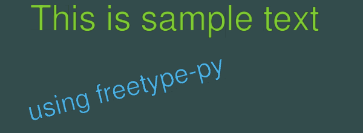

# FreeType / OpenGL text rendering

TrueType Text rendering using [FreeType](https://www.freetype.org/) / [freetype-py](https://pypi.org/project/freetype-py/).  
Inspired by GitHub [rougier/freetype-py](https://github.com/rougier/freetype-py/blob/master/examples/opengl.py) and [LeranOpenGL Text Rendering](https://learnopengl.com/In-Practice/Text-Rendering).



```py
import numpy
from freetype import *
from OpenGL.GL import *
from OpenGL.GLUT import *
from OpenGL.GL import shaders
import math
import glm


text_shader_vert = """
#version 460

layout (location = 0) in vec2 in_pos;
layout (location = 1) in vec2 in_uv;

out vec2 vUV;

layout (location = 0) uniform mat4 model;
layout (location = 1) uniform mat4 projection;

void main()
{
    vUV         = in_uv.xy;
    gl_Position = projection * model * vec4(in_pos.xy, 0.0, 1.0);
}
"""

text_shader_frag = """
#version 460

in vec2 vUV;

layout (binding=0) uniform sampler2D u_texture;
layout (location = 2) uniform vec3 textColor;

out vec4 fragColor;

void main()
{
    vec2 uv = vUV.xy;
    float text = texture(u_texture, uv).r;
    fragColor = vec4(textColor.rgb*text, text);
}
"""

class Window:
    def __init__(self):
        self.base, self.texid = 0, 0
        self.width, self.height = 600, 250
        self.characters = []

        glutInit( sys.argv )
        glutInitDisplayMode( GLUT_DOUBLE | GLUT_RGBA | GLUT_DEPTH )
        glutCreateWindow( "Freetype OpenGL" )
        glutReshapeWindow( self.width, self.height )
        glutDisplayFunc( self.on_display )
        glutReshapeFunc( self.on_reshape )
        glutKeyboardFunc( self.on_keyboard )
        
        self.initgl()
        self.fontsize = 48
        self.makefont(r'C:\source\resource\fonts\gnu-freefont_freesans\freesans.ttf', self.fontsize)

    def run(self):
        glutMainLoop( )

    def initgl(self):
        vertexshader = shaders.compileShader(text_shader_vert, GL_VERTEX_SHADER)
        fragmentshader = shaders.compileShader(text_shader_frag, GL_FRAGMENT_SHADER)
        self.shaderProgram = shaders.compileProgram(vertexshader, fragmentshader)

        vquad = [
          # x   y  u  v    
            0, -1, 0, 0,
            0,  0, 0, 1,
            1,  0, 1, 1,
            0, -1, 0, 0,
            1,  0, 1, 1,
            1, -1, 1, 0
        ]
        vertex_attributes = numpy.array(vquad, dtype=numpy.float32)

        self.vao = glGenVertexArrays(1)
        self.vbo = glGenBuffers(1)        
        glBindVertexArray(self.vao)
        glBindBuffer(GL_ARRAY_BUFFER, self.vbo)
        glBufferData(GL_ARRAY_BUFFER, vertex_attributes, GL_STATIC_DRAW)
        float_size = vertex_attributes.itemsize  
        glVertexAttribPointer(0, 2, GL_FLOAT, False, 4*float_size, None)
        glVertexAttribPointer(1, 2, GL_FLOAT, False, 4*float_size, c_void_p(2*float_size))
        glEnableVertexAttribArray(0)
        glEnableVertexAttribArray(1)
        glBindBuffer(GL_ARRAY_BUFFER, self.vbo)
        glBindVertexArray(0)

    def on_display(self):
        glClearColor(0.2, 0.3, 0.3, 1)
        glClear(GL_COLOR_BUFFER_BIT | GL_DEPTH_BUFFER_BIT)
        glViewport( 0, 0, self.width, self.height )

        glEnable( GL_DEPTH_TEST )
        glEnable( GL_BLEND )
        glBlendFunc( GL_SRC_ALPHA, GL_ONE_MINUS_SRC_ALPHA )

        glUseProgram(self.shaderProgram)
        proj = glm.ortho(0, self.width, self.height, 0, -1, 1)
        glUniformMatrix4fv(1, 1, GL_FALSE, glm.value_ptr(proj) )
        
        glUniform3f(2, 0.5, 0.8, 0.2)
        self.render_text("This is sample text", (25, 50), 1.2, (1, 0))

        glUniform3f(2, 0.3, 0.7, 0.9)
        self.render_text("(C) LearnOpenGL.com", (50, 200), 0.9, (1, -0.25))

        glutSwapBuffers()

    def on_reshape(self, width, height):
        self.width = width
        self.height = height

    def on_keyboard(self, key, x, y ):
        if key == '\033': sys.exit( )

    def makefont(self, filename, fontsize):
        
        face = Face(filename)
        face.set_pixel_sizes( 0, fontsize )
 
        glPixelStorei(GL_UNPACK_ALIGNMENT, 1)
        glActiveTexture(GL_TEXTURE0)

        for c in range(128):
            #face.load_char( chr(c), FT_LOAD_RENDER | FT_LOAD_FORCE_AUTOHINT )
            face.load_char( chr(c), FT_LOAD_RENDER )
            glyph   = face.glyph
            bitmap  = glyph.bitmap
            size    = bitmap.width, bitmap.rows
            bearing = glyph.bitmap_left, glyph.bitmap_top 
            advance = glyph.advance.x

            # create glyph texture
            texObj = glGenTextures(1)
            glBindTexture( GL_TEXTURE_2D, texObj )
            glTexParameterf( GL_TEXTURE_2D, GL_TEXTURE_MAG_FILTER, GL_LINEAR )
            glTexParameterf( GL_TEXTURE_2D, GL_TEXTURE_MIN_FILTER, GL_LINEAR )
            #databuffer = numpy.zeros((cx, width*16), dtype=numpy.ubyte)
            glTexImage2D( GL_TEXTURE_2D, 0, GL_R8, *size, 0, GL_RED, GL_UNSIGNED_BYTE, bitmap.buffer )

            self.characters.append((texObj, size, bearing, advance))

        glPixelStorei(GL_UNPACK_ALIGNMENT, 4)
        glBindTexture(GL_TEXTURE_2D, 0)

    def render_text(self, text, pos, scale, dir):
        glActiveTexture(GL_TEXTURE0)
        glBindVertexArray(self.vao)
        angle_rad    = math.atan2(dir[1], dir[0])
        rotateM      = glm.rotate(glm.mat4(1), angle_rad, glm.vec3(0, 0, 1))
        transOriginM = glm.translate(glm.mat4(1), glm.vec3(*pos, 0))

        char_x = 0
        for c in text:
            c = ord(c)
            ch          = self.characters[c]
            w, h        = ch[1][0] * scale, ch[1][1] * scale
            xrel, yrel  = char_x + ch[2][0] * scale, (ch[1][1] - ch[2][1]) * scale
            char_x     += (ch[3] >> 6) * scale 
            scaleM      = glm.scale(glm.mat4(1), glm.vec3(w, h, 1))
            transRelM   = glm.translate(glm.mat4(1), glm.vec3(xrel, yrel, 0))
            modelM      = transOriginM * rotateM * transRelM * scaleM
            
            glUniformMatrix4fv(0, 1, GL_FALSE, glm.value_ptr(modelM))
            glBindTexture(GL_TEXTURE_2D, ch[0])
            glDrawArrays(GL_TRIANGLES, 0, 6)

        glBindVertexArray(0)
        glBindTexture(GL_TEXTURE_2D, 0)

if __name__ == '__main__':
    import sys
    wnd = Window()
    wnd.run()
```